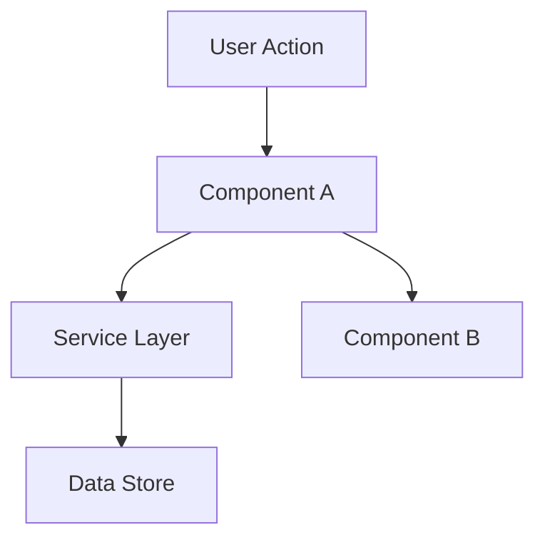

# Design template

````markdown
# [Feature] Design

**Spec**: `.specs/features/[feature]/spec.md`
**Status**: Draft | Approved

---

## Architecture Overview

[Brief description of the architecture approach]


````

---

## Code Reuse Analysis

### Existing Components to Leverage

| Component            | Location            | How to Use                |
| -------------------- | ------------------- | ------------------------- |
| [Existing Component] | `src/path/to/file`  | [Extend/Import/Reference] |
| [Existing Utility]   | `src/utils/file`    | [How it helps]            |
| [Existing Pattern]   | `src/patterns/file` | [Apply same pattern]      |

### Integration Points

| System         | Integration Method                      |
| -------------- | --------------------------------------- |
| [Existing API] | [How new feature connects]              |
| [Database]     | [How data connects to existing schemas] |

---

## Components

### [Component Name]

- **Purpose**: [What this component does - one sentence]
- **Location**: `src/path/to/component/`
- **Interfaces**:
  - `methodName(param: Type): ReturnType` - [description]
  - `methodName(param: Type): ReturnType` - [description]
- **Dependencies**: [What it needs to function]
- **Reuses**: [Existing code this builds upon]

### [Component Name]

- **Purpose**: [What this component does]
- **Location**: `src/path/to/component/`
- **Interfaces**:
  - `methodName(param: Type): ReturnType`
- **Dependencies**: [Dependencies]
- **Reuses**: [Existing code]

---

## Data Models (if applicable)

### [Model Name]

```typescript
interface ModelName {
  id: string
  field1: string
  field2: number
  createdAt: Date
}
```

**Relationships**: [How this relates to other models]

### [Model Name]

```typescript
interface AnotherModel {
  id: string
  // ...
}
```

---

## Error Handling Strategy

| Error Scenario | Handling      | User Impact      |
| -------------- | ------------- | ---------------- |
| [Scenario 1]   | [How handled] | [What user sees] |
| [Scenario 2]   | [How handled] | [What user sees] |

---

## Risks & Concerns

| Concern | Location (file:line) | Impact | Mitigation |
| ------- | -------------------- | ------ | ---------- |
| [Fragile code / tech debt / security / perf / test gap] | `src/path/file.ts:42` | [What breaks or degrades] | [How the design or a follow-up task addresses it] |

> None found - is a valid entry.

---

## Tech Decisions (only non-obvious ones)

| Decision          | Choice          | Rationale     |
| ----------------- | --------------- | ------------- |
| [What we decided] | [What we chose] | [Why - brief] |

> **Project-level decisions:** If a decision here sets a convention, pattern, or constraint that future features must follow, append it to `.specs/STATE.md` `## Decisions` as the next `AD-NNN` entry (see [memory.md](.agents/skills/workflow-spec-driven/references/memory.md)). Feature-local decisions stay only in this table.

