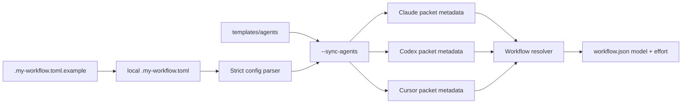

# Agent Model Routing Design

**Spec**: `.specs/features/agent-model-routing/spec.md`
**Status**: Approved

## Architecture Overview

The resolver reads an ignored local version 2 config and tracked provider templates. Explicit sync
initializes missing local config from the tracked example, renders complete ignored runtime packets,
and atomically replaces them only after every source validates. Resolution reads runtime metadata
into the feature snapshot; resume compares it with frozen values.



## Approach Selection

| Approach | Verdict | Reason |
| --- | --- | --- |
| Ignored runtime generation from tracked templates | Selected | Supports all runtimes without turning operator model changes into repository diffs. |
| Per-spawn overrides only | Rejected | Cursor does not provide a proven portable override path and agents could omit the override. |
| Automatic materialization during every resolve | Rejected | Ordinary resolve and resume would gain hidden tracked-file writes. |

## Code Reuse Analysis

### Existing Components to Leverage

| Component | Location | How to Use |
| --- | --- | --- |
| Strict TOML loader | `.agents/skills/workflow-config/scripts/workflow_config.py` | Extend its allowed-key validation and error shape. |
| Atomic snapshot writer | `.agents/skills/workflow-config/scripts/workflow_config.py` | Reuse its temporary-file and replacement pattern for packets. |
| Missing-only adoption | `scripts/adopt.py` | Preserve local config, install tracked templates, then regenerate runtime packets. |
| Resolver tests | `tools/test_workflow_config.py` | Extend existing disposable-repository fixtures. |
| Adoption smoke tests | `scripts/test_adopt.py` | Extend empty and pre-populated target journeys. |

### Integration Points

| System | Integration Method |
| --- | --- |
| Claude Code | Rewrite YAML frontmatter `model` and `effort`. |
| Codex | Rewrite TOML `model` and `model_reasoning_effort`. |
| Cursor | Rewrite the frontmatter model value as `<model>[effort=<effort>]`. |
| Feature workflow | Store and validate delegated-role model and effort in `workflow.json`. |

## Components

### Model matrix parser

- **Purpose**: Validate schema version 2 and return every provider-role model selection.
- **Location**: `.agents/skills/workflow-config/scripts/workflow_config.py`
- **Interfaces**:
  - `load_config(root) -> WorkflowConfig`
  - `model_setting(config, provider, role) -> ModelSetting`
- **Dependencies**: Python 3.11 `tomllib`.
- **Reuses**: Existing strict table and unknown-key checks.

### Native packet materializer

- **Purpose**: Render complete provider-native runtime packets from tracked templates and local settings.
- **Location**: `.agents/skills/workflow-config/scripts/workflow_config.py`
- **Interfaces**:
  - `render_agent_packet(provider, content, setting) -> str`
  - `sync_agents(root, config) -> SyncResult`
- **Dependencies**: Model matrix parser and existing agent path conventions.
- **Reuses**: Existing atomic replacement helper pattern.

### Snapshot model freeze

- **Purpose**: Persist delegated model/effort and reject resume drift.
- **Location**: `.agents/skills/workflow-config/scripts/workflow_config.py`
- **Interfaces**:
  - Extends each `roles.<role>` snapshot object with `model` and `effort`.
  - Compares current native metadata during resume.
- **Dependencies**: Native packet metadata parser.
- **Reuses**: Existing snapshot validation and `--refresh` state transition.

### Adoption integration

- **Purpose**: Install example/templates, initialize missing local config, and generate ignored runtime packets.
- **Location**: `scripts/adopt.py`
- **Interfaces**:
  - Preserve an existing local `.my-workflow.toml` byte-for-byte.
  - Install missing tracked sources and invoke sync after managed assets exist.
- **Dependencies**: Materializer and current missing-only copy behavior.
- **Reuses**: Existing adoption error reporting and disposable tests.

## Data Models

### ModelSetting

```text
provider: claude | codex | cursor
role: planner | implementer | verifier | explorer | deep_reviewer
model: non-empty provider-native string
effort: low | medium | high | xhigh | max | ultra
```

Claude rejects `ultra` during workflow validation. Other provider/model compatibility remains a
runtime concern.

### DelegatedRoleSnapshot

```json
{
  "provider": "codex",
  "agent_file": ".codex/agents/implementer.toml",
  "model": "gpt-5.6-luna",
  "effort": "high"
}
```

## Error Handling Strategy

| Error Scenario | Handling | User Impact |
| --- | --- | --- |
| Missing or unknown config entry | Validate full matrix before rendering | Command exits 2 and names the TOML path. |
| Missing or duplicate packet metadata | Validate all packet inputs before replacement | Command exits 2 and names the packet. |
| Packet metadata differs on resume | Reject resume | Operator synchronizes, then uses explicit `--refresh`. |
| Packet replacement I/O failure | Keep each replacement atomic and report the path | Re-running sync converges safely. |
| Provider rejects a model/effort pair | Surface provider error at agent launch | Operator corrects the central config and synchronizes again. |

## Risks & Concerns

| Concern | Location (file:line) | Impact | Mitigation |
| --- | --- | --- | --- |
| Three native syntaxes can drift | `tools/shared/tests/qa-skills.test.ts:512` | One provider launches different settings. | Generate all formats and enforce matrix parity in tests. |
| Existing adoption promises preserve model pins | `README.md:168` | Documentation contradicts central ownership. | Replace the promise and test instruction preservation separately. |
| Existing snapshots contain no model metadata | `.agents/skills/workflow-config/scripts/workflow_config.py:179` | Old state cannot satisfy the new freeze contract. | Hard-cut snapshot schema and require explicit refresh. |

## Tech Decisions

| Decision | Choice | Rationale |
| --- | --- | --- |
| Sync trigger | Explicit CLI, plus adoption after installation | Operator-local writes happen only at explicit setup/sync boundaries. |
| Source config | Track `.my-workflow.toml.example`; ignore `.my-workflow.toml` | Personal provider access and quota-driven choices do not belong in Git. |
| Packet ownership | Track `templates/agents/`; ignore generated runtime directories | Instructions stay reviewable while runtime metadata remains local. |
| Resume drift | Compare model and effort, not whole-file hashes | Freeze requested execution settings without blocking instruction-only fixes. |
| Snapshot migration | None | The repository forbids backward-compatibility layers. |
