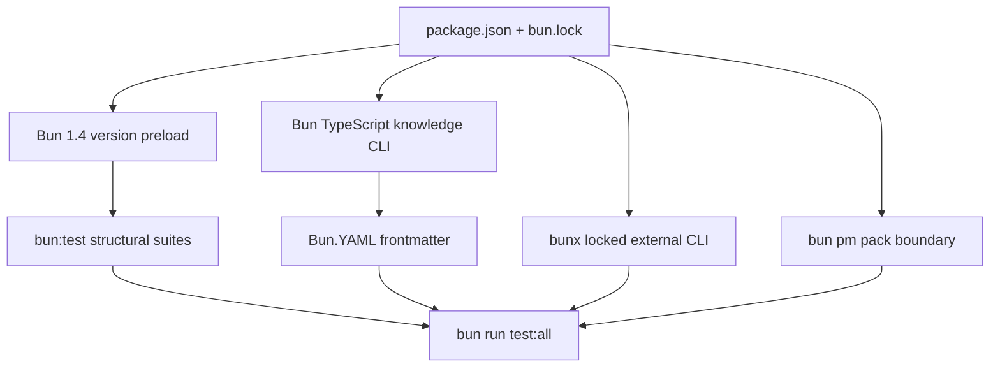

# Bun Tooling Runtime Design

**Spec**: `.specs/features/bun-tooling-runtime/spec.md`
**Status**: Approved

---

## Architecture Overview

Bun becomes the single JavaScript/TypeScript boundary while Python workflow entrypoints remain
unchanged. The migration hard-cuts npm-family execution and uses Bun-native facilities rather than
compatibility wrappers.

## Code Reuse Analysis

| Component | Location | How to Use |
| --- | --- | --- |
| Existing Bun migration | local-main commits `faf4f12..b58da51` | Port only proven Bun discovery, preload, and `bun:test` patterns onto current `workflow-spec-driven` main. |
| Structural test suites | `tools/**/*test.ts` | Preserve assertions; replace only the runner import and invocation boundary. |
| Frontmatter contract | `tools/shared/src/frontmatter.ts` | Keep return/error contract while replacing external parser with `Bun.YAML`. |
| Security skill installer | `scripts/install_security_skills.py` | Reuse fixed argv construction and substitute the locked Bun executable boundary. |
| Adoption contract | `scripts/adopt.py`, `scripts/test_adopt.py` | Preserve ownership/idempotency and stop shipping repository-only test sources. |

## Integration Points

| System | Integration Method |
| --- | --- |
| Bun package manager | Committed text `bun.lock`; frozen install in verification. |
| Bun test runner | `bunfig.toml` limits discovery and preloads the version guard. |
| Bun runtime | Executes TypeScript knowledge CLI and native YAML parser. |
| Bun package utilities | `bun pm pack` inspects the private package in a disposable boundary. |
| Bun executable runner | `bunx --bun --no-install` runs the locked skills CLI. |

## Components

### Bun manifest boundary

- **Purpose**: Declare Bun 1.4, scripts, dependencies, and the sole lockfile.
- **Location**: `package.json`, `bun.lock`, `bunfig.toml`, `tsconfig.json`
- **Dependencies**: Bun 1.4.x
- **Reuses**: Existing package scripts and local proven migration.

### Bun version preload

- **Purpose**: Fail before structural tests under an unsupported Bun version.
- **Location**: `tools/shared/src/bun-version.ts`
- **Interface**: module import side effect validates `Bun.version` against `1.4.x`.
- **Dependencies**: `@types/bun`

### Native frontmatter parser

- **Purpose**: Preserve frontmatter behavior without the external YAML package.
- **Location**: `tools/shared/src/frontmatter.ts`
- **Interface**: existing parser functions and error contract remain unchanged.
- **Dependencies**: `Bun.YAML`

### Bun command boundaries

- **Purpose**: Replace active npm/npx/pack execution in Python and tests.
- **Location**: `scripts/install_security_skills.py`, package/adoption checks
- **Dependencies**: locked dependencies from `bun.lock`

## Error Handling Strategy

| Error Scenario | Handling | User Impact |
| --- | --- | --- |
| Unsupported Bun version | Preload exits non-zero before test discovery. | Clear requirement for Bun 1.4.x. |
| Missing locked skills CLI | `bunx --no-install` exits non-zero; no fetch fallback. | Operator runs frozen install instead of receiving an implicit download. |
| Pack output/residue failure | Disposable path is inspected and cleaned; porcelain must match baseline. | Gate fails without modifying source. |
| Bun YAML semantic divergence | Existing frontmatter cases fail. | Parser change is corrected before commit. |

## Risks & Concerns

| Concern | Location | Impact | Mitigation |
| --- | --- | --- | --- |
| Bun pack output is textual | package/adoption checks | Brittle output parsing across Bun versions. | Inspect a tarball created only in a temp directory, or assert dry-run paths without a custom general parser. |
| Historical npm text is extensive | `docs/qa/`, `.specs/features/` | A naive scan rewrites or rejects true history. | Centralize a narrow historical-path allowlist in the canonical contract test. |
| Local Bun work is based on an obsolete TLC line | local `main` | Blind cherry-pick would restore removed authority. | Port behavior file-by-file onto `origin/main`; do not cherry-pick feature commits wholesale. |
| Bun YAML errors may differ | `tools/shared/src/frontmatter.ts` | Knowledge checks could accept/reject different malformed inputs. | Preserve exact existing tests and add only spec-mapped edge assertions. |

## Tech Decisions

| Decision | Choice | Rationale |
| --- | --- | --- |
| Package authority | Bun 1.4 only | Matches every consuming project and removes duplicated runtime state. |
| Test runner | Native `bun:test` | No compatibility runner or Vitest dependency. |
| YAML | `Bun.YAML` | Native capability removes a runtime dependency. |
| Lock migration | Delete `package-lock.json`; commit `bun.lock` | One dependency graph and one frozen-install contract. |
| External packages | `bunx --bun --no-install` | Locked, Bun-executed, fail-closed command boundary. |
| Historical docs | Preserve unchanged | Past evidence must remain truthful. |
