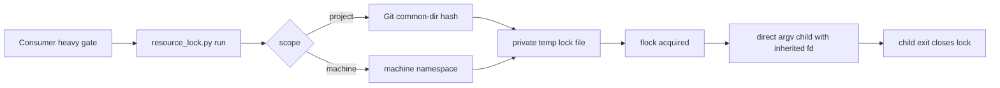

# Configurable Test Lock Design

**Spec**: `.specs/features/configurable-test-lock/spec.md`
**Status**: Approved

## Architecture Overview

Use one Python standard-library command wrapper around `fcntl.flock`. The wrapper derives a safe
lock key, acquires it with a bounded non-blocking loop, passes the descriptor to the child, and
returns the child's status. It is separate from the existing lane-wide `resource_provider` lease.

## Approach Selection

| Approach | Decision | Reason |
| --- | --- | --- |
| Command wrapper with kernel lock | Selected | Holds only during the heavy command, works outside assisted execution, and recovers through descriptor closure. |
| Existing resource provider only | Rejected | It holds a lease for the entire worker slice and does not cover manual gates. |
| Daemon or persistent lease service | Rejected | Adds lifecycle, recovery, and dependency surface without supporting a required capability. |

## Code Reuse Analysis

| Existing component | Location | How to use |
| --- | --- | --- |
| CRM kernel-lock behavior | `crm/tools/machine-lock.py` | Reuse bounded wait, holder metadata, and inherited-descriptor behavior. |
| Creatista command wrapper | `creatista/tools/test-lock/run.sh` | Reuse explicit consumer opt-in and project-level serialization intent. |
| Parallel adoption catalog | `scripts/adopt.py` | Add one file to `PARALLEL_PATHS`; preserve fixed layers and manifest ownership. |
| Canonical adoption suite | `scripts/test_adopt.py` | Extend the existing parallel-layer boundary assertions. |

## Components

### Test resource lock CLI

- **Purpose**: Serialize one named heavy command at project or machine scope.
- **Location**: `tools/resource_lock.py`
- **Interfaces**:
  - `run --resource NAME [--scope SCOPE] [--timeout-seconds N] -- COMMAND...`
  - `main(argv: Sequence[str] | None) -> int`
- **Dependencies**: Python standard library, Unix `fcntl`, Git only for project identity.
- **Reuses**: Existing tool docstring, argparse, `__main__`, and no-third-party conventions.

### Contract test

- **Purpose**: Prove concurrency, timeout, crash recovery, argv safety, and lock-path controls through
  disposable repositories and subprocesses.
- **Location**: `tools/test_parallel_resource_lock.py`
- **Interface**: executable Python test discovered by `bun run test:python`.
- **Dependencies**: Python standard library and Git.

### Adoption integration

- **Purpose**: Install and own the dormant tool with the parallel layer.
- **Locations**: `scripts/adopt.py`, `scripts/test_adopt.py`, `templates/adoption/agents/parallel.md`.
- **Dependencies**: Existing adoption catalog, managed-block template, and manifest schema.

## Lock Model

| Field | Derivation |
| --- | --- |
| Root | `${TMPDIR}/my-workflow-test-lock-<uid>`; real directory, current-user owned, private mode |
| Project namespace | SHA-256 prefix of resolved `git rev-parse --git-common-dir` |
| Machine namespace | Literal `machine` |
| Resource | Validated lowercase identifier `[a-z0-9][a-z0-9._-]{0,63}` |
| Lock file | `<scope>-<namespace>-<resource>.lock`, opened without following symlinks |
| Holder metadata | PID, opaque project identifier, UTC start time, scope, resource |

The wrapper never stores or prints command argv or environment values. The child inherits the open
lock descriptor, so killing the wrapper cannot release the resource while the heavy child survives.

## Error Handling Strategy

| Error scenario | Handling | Caller impact |
| --- | --- | --- |
| Invalid scope/resource/timeout or missing command | argparse error | Exit `2`; command does not run |
| Project scope outside Git | explicit diagnostic | Exit `2`; command does not run |
| Unsafe root or lock-file type/ownership | fail closed | Exit `2`; referent remains untouched |
| Resource occupied | bounded poll and JSON wait diagnostic | Wait until release or timeout |
| Timeout | close waiter descriptor | Exit `75`; command does not run |
| Executable absent | report executable name only | Exit `127` |
| Child exits | close parent descriptor and return status | Kernel releases after final inherited descriptor closes |

## Requirement Mapping

| Requirement | Component |
| --- | --- |
| CTL-01, CTL-02, CTL-03, CTL-04 | Lock-key derivation and acquisition loop |
| CTL-05, CTL-07 | Inherited descriptor and child lifecycle |
| CTL-06 | Bounded timeout |
| CTL-08, SEC-001, SEC-002, SEC-003, SEC-004 | CLI, direct argv execution, safe filesystem boundary |
| CTL-09 | Parallel adoption catalog and canonical adoption test |

## Risks & Concerns

| Concern | Location | Impact | Mitigation |
| --- | --- | --- | --- |
| Shared temporary path can be substituted | lock root and file open | Redirected writes or false ownership | Verify owner/type/mode and use no-follow open. |
| Wrapper death can orphan a running child | child lifecycle | A second heavy command starts too early | Pass the lock descriptor to the child. |
| Project root differs between linked worktrees | identity derivation | Worktrees fail to serialize | Hash the resolved Git common directory, not worktree root. |
| Broad resource names serialize unrelated work | consumer command configuration | Lost wall-time benefit | Document resource-specific names and leave light tests unwrapped. |
| Lane provider appears equivalent | `parallel_execute.py` | Whole-slice over-serialization | Keep command-lock and lane-lease contracts separate under AD-017. |

## Tech Decisions

| Decision | Choice | Rationale |
| --- | --- | --- |
| Lock primitive | `fcntl.flock` | Kernel cleanup and inherited-descriptor semantics, no dependency. |
| Configuration surface | Per-command flags | Different resources in one project may need different scopes. |
| Adoption unit | Existing `parallel` layer, runtime opt-in | Avoids another catalog/schema dimension and changes no gate until invoked. |
| Diagnostics | Secret-free JSON on stderr | Machine-readable without contaminating wrapped stdout. |
| Capacity | One holder per resource | Matches the proven need; capacity pools are deferred. |
