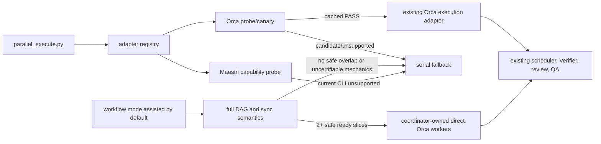

# Host-Agnostic Slice Parallelization Design

**Spec:** `.specs/features/host-agnostic-slice-parallelization/spec.md`
**Status:** Draft delta; original adapter design remains approved

## Architecture Overview

Keep `parallel_execute.py` as the deterministic scheduler. Add a narrow compatibility boundary before
adapter construction. Orca implements read-only identity inspection plus an explicit canary. Maestri
implements read-only capability inspection and remains unavailable until its CLI can prove the full
lifecycle and cleanup contract. Mode `assisted` becomes the default policy and uses the deterministic
planner plus one shipped coordinator probe. It never enters the automatic adapter path.



Approaches considered:

| Approach | Decision | Reason |
| --- | --- | --- |
| Rewrite scheduler around host SDKs | Rejected | Existing core already owns DAG, state, sync, and fallback. |
| Parse Maestri text and leave floor cleanup to UI | Rejected | It cannot prove ownership or zero residue. |
| Adapter registry plus compatibility receipts | Selected | Smallest change that prevents false capability claims and keeps future hosts isolated. |
| Rebuild automatic Orca orchestration in the workflow | Rejected | The main agent owns assisted handoff until upstream exposes reliable transport and lifecycle support. |

## Code Reuse Analysis

| Existing component | Location | Reuse |
| --- | --- | --- |
| Executor state/factory | `.agents/skills/autonomous/scripts/parallel_execute.py` | Add preflight command and compatibility-aware selection. |
| Orca receipt validation/redaction | `.agents/skills/autonomous/scripts/orca_adapter.py` | Reuse fixed argv, structured parsing, identity checks, and cleanup methods. |
| Runtime state path/atomic JSON | `parallel_execute.py` | Store repository-scoped compatibility PASS outside versioned specs. |
| Parallel policy | `.agents/skills/autonomous/references/parallelization.md` | Document adapter proof without changing TLC. |
| Existing tests | `tools/test_parallel_executor.py`, `tools/test_orca_adapter.py` | Extend recording-runner patterns. |
| Retest 12 contract and report | `docs/qa/scenarios/QAS-coordinate-assisted-orca-slices.md`, `docs/qa/reports/2026-08-27-assisted-orca-slices.md` | Preserve the proven route, pointer, reconciliation, checkpoint, and cleanup mechanics. |

## Components

### Adapter registry

- **Purpose:** Resolve `auto|orca|maestri`, keep disabled effect-free, and require compatibility PASS.
- **Location:** `.agents/skills/autonomous/scripts/parallel_execute.py`
- **Interface:** `preflight(adapter, canary=False) -> CompatibilityResult`; existing `start/resume/status`.
- **Failure semantics:** incompatible or unknown means serial fallback, never cross-host fallback.

### Orca compatibility probe

- **Purpose:** Bind actual installed runtime behavior to a local PASS receipt.
- **Location:** `.agents/skills/autonomous/scripts/orca_adapter.py`
- **Interfaces:** `identity()`, `probe()`, `canary()`.
- **Identity:** repository, adapter, app version, sorted capabilities, executable realpath and metadata.
- **Canary:** reusable Run/Task identity, one disposable existing Git checkout, worker start, correlated
  completion/read/ack/release, worktree removal, and absence checks.
- **Failure semantics:** no PASS until cleanup is complete; partial ownership remains in diagnostics.

### Maestri capability probe

- **Purpose:** Represent Maestri explicitly without pretending its current CLI is automatable safely.
- **Location:** `.agents/skills/autonomous/scripts/maestri_adapter.py`
- **Interfaces:** `identity()`, `probe()`; execution methods are unavailable until probe is compatible.
- **Required capabilities:** terminal/socket/CLI identity, structured floor and agent receipts, structured
  completion events, agent dismissal, and floor deletion.
- **Failure semantics:** return missing capability names before any mutating command.

### Coordinator-assisted Orca execution

- **Purpose:** Overlap eligible slices by default while automatic Orca orchestration is known incompatible.
- **Location:** `tools/orca_assisted_probe.py` plus
  `.agents/skills/autonomous/references/parallelization.md`; executed by the main agent through
  Orca's direct worktree and terminal CLI.
- **Ownership:** The coordinator creates one explicit-base worktree per slice, records its immutable
  receipt and exact startup terminal handle, proves that startup shell is new and unused, promotes
  that shell with the frozen provider command, records checkpoints in the Orca worktree comment,
  reacquires only that exact handle when stale, and performs exact cleanup. A second terminal or
  ambiguous startup ownership serializes before prompt or task edits.
- **Wait state:** `slice=<id>; state=parked; completed_through=<task>; next=<task>;
  blocked_on=<slice:task>; head=<sha>`. This is a human/agent handoff hypothesis, always reconciled
  against Git and `tasks.md`; no program accepts it as a machine lifecycle receipt.
- **Synchronization:** Rebase or otherwise synchronize only the private dependent lane at declared
  dependency checkpoints, consume the exact producer commit, and rerun the affected gate before
  follow-up. Conflicts return to serial recovery.
- **Compatibility:** This path never writes a compatibility receipt and never changes the automatic
  executor's `unsupported` result.

### Assisted mode boundary

- **Purpose:** Keep assisted coordination distinct from automatic `safe`/`full` adapters.
- **Location:** `.agents/skills/workflow-config/scripts/workflow_config.py`,
  `.agents/skills/workflow-config/scripts/parallel_plan.py`, and
  `.agents/skills/autonomous/scripts/parallel_execute.py`.
- **Semantics:** The resolver defaults to `assisted`; the planner applies `full` DAG readiness and
  `sync_after` semantics; `parallel_execute.py` returns the assisted coordination plan before adapter
  construction. `disabled` remains effect-free serial. `safe` and `full` remain automatic-only.

### Assisted coordinator probe

- **Purpose:** Make Retest 12's proven mechanics reusable without importing QA evidence.
- **Location:** `tools/orca_assisted_probe.py`.
- **Interface:** Stdlib-only argparse subcommands for create/route, one logical turn, checkpoint and
  same-handle reconciliation, producer sync, cleanup, and the composed run; every command emits one
  JSON object and module import has no side effect.
- **Parameters:** Repository/worktree/branch identities, packet path, provider/model/effort, task and
  commit expectations, gate, marker, timeouts, and ownership prefix are caller inputs. No disposable
  fixture task ID, subject, session prefix, evidence path, or packet filename remains hardcoded.
- **Mutation rule:** `create`, `send`, comment `set`, terminal `stop`, and worktree `rm` execute once
  per logical operation. Only read-only inspections retry inside bounded settle/reconciliation windows.
- **Transport:** Complete packet files live outside slice worktrees; terminal sends carry only the
  fixed-shape pointer, with no inline or length-based fallback.

## Data Models

```text
CompatibilityReceipt {
  version, repository, adapter,
  runtime { app_version, capabilities, executable_identity },
  proof { source, checked_at, cleanup },
  status
}

CompatibilityResult {
  adapter, status, runtime, proof?, missing_capabilities[], reason?
}
```

Only `status=compatible` with `proof.cleanup=clean` is persisted or consumed by start/resume.

## Error Handling Strategy

| Error | Handling | Impact |
| --- | --- | --- |
| Disabled mode | Return before registry lookup. | Existing serial path. |
| Host identity malformed/unreachable | `unsupported` with stable reason. | Zero effects. |
| Orca candidate lacks cached PASS | `candidate`. | Explicit canary required. |
| Canary partial failure | Attempt only exact owned cleanup; retain IDs if unproven. | Adapter remains blocked. |
| Maestri machine contract incomplete | List missing capabilities. | Adapter remains blocked. |
| Assisted checkpoint dirty or ambiguous | Park the worker and retain its exact worktree. | Serial recovery; no deletion or follow-up. |
| Assisted startup shell active, duplicated, or unobservable | Do not promote it or send a task packet. | Serial recovery; retain only verified owned setup. |
| Assisted terminal handle stale | Re-list the owned worktree's terminals and select its sole worker handle. | Resume the same worker; never duplicate it. |
| Assisted sync conflict or affected gate failure | Abort lane continuation. | Serial recovery; no automatic resolution. |
| Assisted mode has fewer than two ready slices or fails isolation/resource proof | Do not construct an automatic adapter or start an assisted lane. | Sequential execution. |
| Assisted mutation receipt is transient, missing, or erroneous | Do not repeat the mutation; reconcile through bounded read-only inspection of the same owned effect. | Continue only on one complete exact effect; otherwise serialize. |

## Risks & Concerns

| Concern | Location | Impact | Mitigation |
| --- | --- | --- | --- |
| Orca status lacks build SHA | Orca `status --json` | Version cannot prove PR ancestry. | Canary proves installed behavior; release ancestry stays QA evidence. |
| Canary Run/Task history may remain | Orca orchestration has no run-delete verb | Small diagnostic history residue. | Reuse one version-bound canary identity; remove worker/worktree resources. |
| Maestri output is mostly human-readable | Current documented CLI | Unsafe correlation and cleanup. | Fail closed; do not parse text. |
| Existing adapter factory trusts capability alone | `parallel_execute.py` | Broken `1.4.188` can dispatch. | Require matching PASS receipt before construction. |
| Retest probe sources are QA evidence outside the adopted pack | `docs/qa/evidence/2026-08-27-assisted-orca-slices/` | Consumers receive prose but not executable hardening. | Flatten the live Retest 12 behavior into one shipped module and verify it with fake Orca. |

## Tech Decisions

| Decision | Choice | Rationale |
| --- | --- | --- |
| Scheduler | Reuse unchanged deterministic core | The missing work is capability proof, not scheduling. |
| Canary trigger | Explicit `preflight --canary` | Normal feature start must not create diagnostic effects. |
| Cache | Repository-local, runtime-identity-bound PASS only | Avoid repeated pollution and stale enablement. |
| Maestri current behavior | Explicit unsupported adapter | Reliability wins over nominal multi-host support. |
| Current Orca assisted behavior | Default main-agent supervision for safe independent slices | Capture overlap now without pretending structured orchestration works. |
| Mode separation | `assisted` defaults to direct coordination; `safe`/`full` stay automatic | Avoid coupling the temporary host workaround to future adapter semantics. |
| Packet delivery | Pointer-only until upstream transport is proven | No host receipt currently distinguishes complete delivery from truncation. |

AD-019 supersedes the opt-in/default parts of AD-011 and AD-017. AD-012 through AD-014 remain active,
and AD-018 remains the packet transport rule until upstream support is proven.
