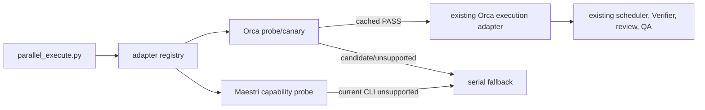

# Host-Agnostic Slice Parallelization Design

**Spec:** `.specs/features/host-agnostic-slice-parallelization/spec.md`
**Status:** Approved from the operator's reliability constraints

## Architecture Overview

Keep `parallel_execute.py` as the deterministic scheduler. Add a narrow compatibility boundary before
adapter construction. Orca implements read-only identity inspection plus an explicit canary. Maestri
implements read-only capability inspection and remains unavailable until its CLI can prove the full
lifecycle and cleanup contract.



Approaches considered:

| Approach | Decision | Reason |
| --- | --- | --- |
| Rewrite scheduler around host SDKs | Rejected | Existing core already owns DAG, state, sync, and fallback. |
| Parse Maestri text and leave floor cleanup to UI | Rejected | It cannot prove ownership or zero residue. |
| Adapter registry plus compatibility receipts | Selected | Smallest change that prevents false capability claims and keeps future hosts isolated. |

## Code Reuse Analysis

| Existing component | Location | Reuse |
| --- | --- | --- |
| Executor state/factory | `.agents/skills/autonomous/scripts/parallel_execute.py` | Add preflight command and compatibility-aware selection. |
| Orca receipt validation/redaction | `.agents/skills/autonomous/scripts/orca_adapter.py` | Reuse fixed argv, structured parsing, identity checks, and cleanup methods. |
| Runtime state path/atomic JSON | `parallel_execute.py` | Store repository-scoped compatibility PASS outside versioned specs. |
| Parallel policy | `.agents/skills/autonomous/references/parallelization.md` | Document adapter proof without changing TLC. |
| Existing tests | `tools/test_parallel_executor.py`, `tools/test_orca_adapter.py` | Extend recording-runner patterns. |

## Components

### Adapter registry

- **Purpose:** Resolve `auto|orca|maestri`, keep disabled effect-free, and require compatibility PASS.
- **Location:** `.agents/skills/autonomous/scripts/parallel_execute.py`
- **Interface:** `preflight(adapter, canary=False) -> CompatibilityResult`; existing `start/resume/status`.
- **Failure semantics:** incompatible or unknown means serial fallback, never cross-host fallback.

### Orca compatibility probe

- **Purpose:** Bind actual installed runtime behavior to a local PASS receipt.
- **Location:** `.agents/skills/autonomous/scripts/orca_adapter.py`
- **Interfaces:** `identity()`, `probe()`, `canary()`.
- **Identity:** repository, adapter, app version, sorted capabilities, executable realpath and metadata.
- **Canary:** reusable Run/Task identity, one disposable existing Git checkout, worker start, correlated
  completion/read/ack/release, worktree removal, and absence checks.
- **Failure semantics:** no PASS until cleanup is complete; partial ownership remains in diagnostics.

### Maestri capability probe

- **Purpose:** Represent Maestri explicitly without pretending its current CLI is automatable safely.
- **Location:** `.agents/skills/autonomous/scripts/maestri_adapter.py`
- **Interfaces:** `identity()`, `probe()`; execution methods are unavailable until probe is compatible.
- **Required capabilities:** terminal/socket/CLI identity, structured floor and agent receipts, structured
  completion events, agent dismissal, and floor deletion.
- **Failure semantics:** return missing capability names before any mutating command.

## Data Models

```text
CompatibilityReceipt {
  version, repository, adapter,
  runtime { app_version, capabilities, executable_identity },
  proof { source, checked_at, cleanup },
  status
}

CompatibilityResult {
  adapter, status, runtime, proof?, missing_capabilities[], reason?
}
```

Only `status=compatible` with `proof.cleanup=clean` is persisted or consumed by start/resume.

## Error Handling Strategy

| Error | Handling | Impact |
| --- | --- | --- |
| Disabled mode | Return before registry lookup. | Existing serial path. |
| Host identity malformed/unreachable | `unsupported` with stable reason. | Zero effects. |
| Orca candidate lacks cached PASS | `candidate`. | Explicit canary required. |
| Canary partial failure | Attempt only exact owned cleanup; retain IDs if unproven. | Adapter remains blocked. |
| Maestri machine contract incomplete | List missing capabilities. | Adapter remains blocked. |

## Risks & Concerns

| Concern | Location | Impact | Mitigation |
| --- | --- | --- | --- |
| Orca status lacks build SHA | Orca `status --json` | Version cannot prove PR ancestry. | Canary proves installed behavior; release ancestry stays QA evidence. |
| Canary Run/Task history may remain | Orca orchestration has no run-delete verb | Small diagnostic history residue. | Reuse one version-bound canary identity; remove worker/worktree resources. |
| Maestri output is mostly human-readable | Current documented CLI | Unsafe correlation and cleanup. | Fail closed; do not parse text. |
| Existing adapter factory trusts capability alone | `parallel_execute.py` | Broken `1.4.188` can dispatch. | Require matching PASS receipt before construction. |

## Tech Decisions

| Decision | Choice | Rationale |
| --- | --- | --- |
| Scheduler | Reuse unchanged deterministic core | The missing work is capability proof, not scheduling. |
| Canary trigger | Explicit `preflight --canary` | Normal feature start must not create diagnostic effects. |
| Cache | Repository-local, runtime-identity-bound PASS only | Avoid repeated pollution and stale enablement. |
| Maestri current behavior | Explicit unsupported adapter | Reliability wins over nominal multi-host support. |

This extends active AD-012 without changing AD-011 task/review policy or AD-013 Orca worktree ownership.
