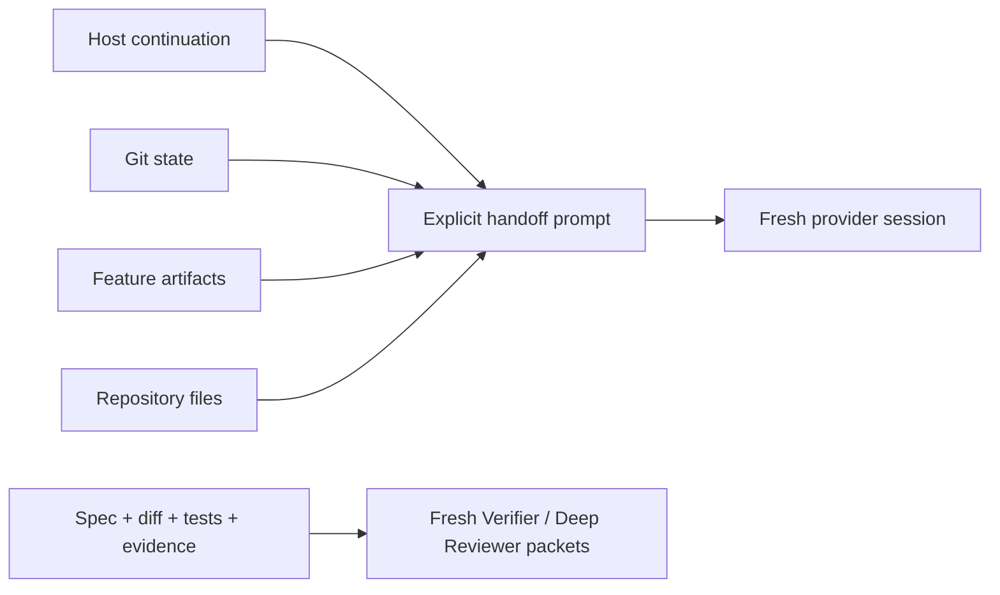

# Host-Owned Session Continuation Design

**Spec**: `.specs/features/host-owned-session-continuation/spec.md`
**Status**: Approved by the explicit removal brief

## Architecture Overview

Delete the repository-owned runtime and make repository state plus explicit prompts the only portable semantic boundary. Reuse existing adoption, QA, package, decision-index, and test infrastructure to prove absence. Add no runtime replacement.

## Approach Selection

| Approach | Result | Trade-off |
| --- | --- | --- |
| Delete and use host-owned continuation | Chosen | Smallest current surface; host capabilities vary, while repository semantics remain portable |
| Keep a deprecated wrapper | Rejected | Violates no-backward-compatibility and retains maintenance/runtime risk |
| Build a new repository handoff protocol | Rejected | Recreates the removed subsystem and duplicates host behavior |

The user selected deletion and host ownership in the feature brief, so no additional design choice remains.

## Code Reuse Analysis

| Existing component | Location | Use |
| --- | --- | --- |
| Adoption fixture suite | `scripts/test_adopt.py` | Extend canonical clean and repeat adoption checks |
| Workflow contract suite | `tools/shared/tests/qa-skills.test.ts` | Own deleted-path, reference-allowlist, reviewer, history, package, and release assertions |
| Version owner | `npm version 0.6.0 --no-git-tag-version` | Regenerate package and lockfile versions without a tag |
| Decision indexer | `tools/ad-index.py` | Regenerate `.specs/AD-INDEX.md` after `AD-011` |
| QA CLI/manual adapter | `docs/qa/README.md` | Plan and execute public-interface verification without installing tools |

## Components

### Removed subsystem

- **Purpose**: Delete scripts, feature-specific tests, workflow guide, active scenario, and obsolete feature workflow state.
- **Location**: Existing repository-owned paths only.
- **Dependencies**: None.
- **Reuses**: Git history as recovery and audit evidence.

### Adoption absence contract

- **Purpose**: Prove clean and repeated adoption never creates removed artifacts or host mutations.
- **Location**: `scripts/test_adopt.py`.
- **Dependencies**: Existing disposable fixtures and sentinels.
- **Reuses**: Canonical adoption test harness.

### Current-contract scan

- **Purpose**: Prove all current surfaces are clean while exact historical/removal-note paths remain allowed.
- **Location**: `tools/shared/tests/qa-skills.test.ts`.
- **Dependencies**: Explicit file allowlist and tracked-tree scan.
- **Reuses**: Existing Vitest contract suite.

### Release and QA state

- **Purpose**: Align v0.6.0 authorities and record public-interface QA.
- **Location**: Existing package, changelog, decision, and `docs/qa/` authorities.
- **Dependencies**: Technical verification and Deep Review precede final QA execution.
- **Reuses**: Existing release scenario, charter, and report formats.

## Data Models

No runtime model, config, database, marker, payload, hook, or protocol remains. The only new structured state is ordinary Markdown release/QA evidence and existing package metadata.

## Error Handling Strategy

| Error scenario | Handling | User impact |
| --- | --- | --- |
| Non-allowlisted reference survives | Contract test fails with exact path and match | Release preparation stops |
| Historical protected file changes | Byte comparison fails | Release preparation stops |
| Adoption creates or mutates host-boundary state | Adoption test fails with exact artifact/sentinel | Release preparation stops |
| Version authority diverges | Parity assertion fails | Release preparation stops |
| Required local gate or QA fails | Remediate locally within workflow caps | No publication occurs |

## Risks & Concerns

| Concern | Location | Impact | Mitigation |
| --- | --- | --- | --- |
| A broad scan exclusion could hide active instructions | Current-contract test | False green | Allow exact historical/removal-note files only and report every match |
| Historical cleanup could rewrite truthful evidence | Historical QA and changelog paths | Audit loss | Compare explicit protected paths byte-for-byte with `v0.5.0` |
| Deleting old workflow state conflicts with normal artifact retention | `.specs/features/ai-memory-handoff/` | Loss of current-tree planning state | Explicit brief and scan allowlist take precedence; Git history preserves it |
| Adoption assertions could inspect or mutate the real operator environment | `scripts/test_adopt.py` | External state damage | Use disposable fixtures and sentinels; never run lifecycle cleanup commands |
| Another feature may join v0.6.0 | Release metadata | Premature publication | Prepare local `0.6.0` only; do not tag, push, publish, or release |

## Tech Decisions

| Decision | Choice | Rationale |
| --- | --- | --- |
| Continuation owner | Host | Host-native continuation proved repository runtime unnecessary |
| Durable semantic context | Repository files, Git state, feature artifacts, explicit prompts | Portable and host-neutral |
| Reviewer context | Fresh role packets | Independent conclusions cannot inherit author/operator narrative |
| Historical migration help | Link tagged v0.5.0 guide | Exact historical commands stay available without copying or executing them |

Project-level ownership is recorded by `AD-011`, which supersedes `AD-008`.
