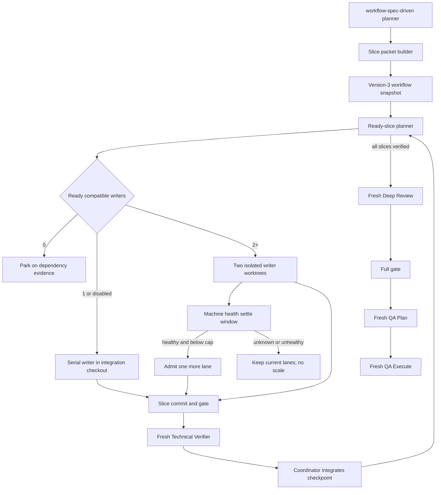

# Hybrid Slice Execution Design

**Spec:** `.specs/features/hybrid-slice-execution/spec.md`
**Context:** `.specs/features/hybrid-slice-execution/context.md`
**Surface:** `.specs/features/hybrid-slice-execution/dx.md`
**Threat model:** `.specs/features/hybrid-slice-execution/threat-model.md`
**Status:** Approved

## Chosen Approach

Use one workflow-owned spec-driven skill, a dynamic ready-slice scheduler, and the existing
provider-neutral executor/resource-provider boundary. Serial work stays in the clean integration
checkout. Concurrent writers get isolated worktrees. Admission starts with two writers and adds one
slot per healthy settle window. The Orca adapter uses a shipped pointer-only probe; verification roles
remain separate from writer lanes.

| Approach | Benefit | Cost | Decision |
| --- | --- | --- | --- |
| Dynamic hybrid lanes with health-gated 2→4 admission | Best speed/resource balance; no idle fixed ownership; read-only roles stay cheap | Scheduler and lifecycle need deterministic state | Chosen by the human and AD-015 |
| Two fixed persistent lanes | Fewer sessions and predictable machine use | Imbalanced lanes, accumulated context, needless worktrees on small features | Rejected |
| One worktree per ready slice without a ceiling | Lowest idealized wall time | Unbounded machine pressure, repeated context, harder integration | Rejected |

AD-015 supersedes AD-011's opt-in modes and unchanged-TLC premise. AD-012 through AD-014 remain
active: provider-neutral effects, deterministic Git ownership, and blocker-fingerprint convergence
continue unchanged unless this design narrows them.

## Architecture Overview



## Vertical Slice Boundaries

| Slice | Observable result | Checkpoint for consumers |
| --- | --- | --- |
| S1 Lean context contract | Adoption source contains one attributed slice-native skill; packet budgets execute | CP-S1: new skill and packet CLI pass canonical contract tests |
| S2 Version-3 workflow contract | Project owner can resolve `assisted`/`disabled` plus `max_workers` into a coherent snapshot | CP-S2: resolver and planner accept only v3 |
| S3 Adaptive hybrid scheduler | Coordinator chooses serial, two-lane, or incremental healthy lanes and leases heavy gates | CP-S3: deterministic scheduler trace and residue-free fake provider pass |
| S4 Pointer-only Orca lifecycle | Consumer receives a shipped probe that cannot duplicate mutations or clean another run | CP-S4: fake Orca lifecycle/import checks pass |
| S5 Independent proof pipeline | Every writer checkpoint and final tree are certified by fresh roles | CP-S5: role-route contract and trace tests pass |
| S6 Adoption and truthful QA | Disposable consumer receives the complete workflow and proves it without live Orca | CP-S6: byte-identical dry-run, offline gate, and QA status audit pass |

S1 is the context foundation. After CP-S1, S2, S4, and S5 can progress independently. S3 consumes
CP-S2 and the S4 effect contract. S6 consumes all prior checkpoints.

## Code Reuse Analysis

### Existing Components to Leverage

| Component | Location | How to use |
| --- | --- | --- |
| TLC planning scripts and artifact validators | `.agents/skills/tlc-spec-driven/` | Copy only maintained planning/validation behavior into the renamed attributed skill, then delete the old tree. |
| Workflow config resolver | `.agents/skills/workflow-config/scripts/workflow_config.py` | Replace v2 and old mode parsing with one v3 contract; retain model/profile/cadence logic. |
| Ready-slice and path-conflict planner | `.agents/skills/workflow-config/scripts/parallel_plan.py` | Retain DAG/conflict analysis; align v3 snapshot reading and emit admission-ready metadata. |
| Provider-neutral executor | `.agents/skills/autonomous/scripts/parallel_execute.py` | Extend existing receipts, worktree lifecycle, checkpoint sync, and resource provider instead of adding a coordinator. |
| Orca adapter | `.agents/skills/autonomous/scripts/orca_adapter.py` | Preserve fixed adapter boundary and redaction; route pointer effects through the shipped probe contract. |
| Resource provider leases | `parallel_execute.py` `ResourceProvider` | Add heavy-gate claims to the existing acquire/release correlation. No new lock system. |
| Adoption manifest | `scripts/adopt.py` | Replace the TLC path, add the probe, and preserve COPY/COPY_MISSING ownership rules. |
| Canonical suites | `tools/test_workflow_config.py`, `tools/test_parallel_plan.py`, `tools/test_parallel_executor.py`, `tools/test_orca_adapter.py`, `scripts/test_adopt.py`, `tools/shared/tests/autonomous-parallelization.test.ts` | Extend owners of each invariant; do not add parallel duplicate suites. |

### Integration Points

| Boundary | Contract |
| --- | --- |
| Config → frozen snapshot | Version 3, exact keys, explicit refresh for any old active snapshot |
| Skill planner → executor | Slice-only packet JSON plus byte telemetry and checkpoint IDs |
| Planner → scheduler | Ready slices, dependency checkpoints, predicted write paths, resource claims |
| Scheduler → host health | Redacted stdlib JSON; stale/unknown denies lane 3+ |
| Scheduler → resource provider | Existing stdin/stdout JSON acquire/release protocol with correlated lease IDs |
| Executor → Orca | Full packet on disk, short pointer text only, bounded read-only observations |
| Slice → dependent slice | Verified commit checkpoint synchronized by coordinator before continuation |
| Source → adopted consumer | COPY_PATHS byte identity, COPY_MISSING preservation, obsolete path absence |

## Components and Interfaces

### Workflow-owned skill

- **Location:** `.agents/skills/workflow-spec-driven/`
- **Purpose:** Own Specify, Design, Tasks, Execute, slice packets, independent verification, validators,
  and CC BY 4.0 attribution without obsolete phase batches.
- **Interfaces:** Existing skill activation plus
  `slice_packet.py build --input --output --telemetry` from `dx.md`.
- **Reuses:** Current validators, lessons, convergence scripts, and planning guidance after references
  are made slice-native and context-conditional.

### Packet builder

- **Location:** `.agents/skills/workflow-spec-driven/scripts/slice_packet.py`
- **Purpose:** Validate allowed packet sections, render pointer-addressable Markdown, enforce 3,072-byte
  role and 10,240-byte slice budgets, and emit redacted JSON telemetry.
- **Interfaces:** `build_packet(request) -> packet, telemetry`; CLI in `dx.md`.
- **Failure:** Writes no usable packet and dispatches nothing when schema or budget fails.

### Version-3 resolver and planner

- **Locations:** `.agents/skills/workflow-config/scripts/workflow_config.py`,
  `.agents/skills/workflow-config/scripts/parallel_plan.py`
- **Purpose:** Validate public config/snapshot v3, freeze policy, reject stale snapshots, and calculate
  ready/path-compatible slices plus resource claims.
- **Interfaces:** Existing resolver/planner CLIs with the new fields from `dx.md`.
- **Failure:** Any stale or malformed public artifact exits before effect planning.

### Machine-health provider

- **Location:** `.agents/skills/autonomous/scripts/machine_health.py`
- **Purpose:** Convert platform-native CPU, memory, disk, and active-heavy-gate signals into one small
  redacted admission decision.
- **Interfaces:** `observe(now, active) -> HealthEvidence`; JSON schema from `dx.md`.
- **Dependencies:** Python standard library; optional existing host commands with bounded execution.
- **Failure:** `admit_one=false`; no raw command output reaches agent context.

### Adaptive scheduler and executor

- **Location:** `.agents/skills/autonomous/scripts/parallel_execute.py`
- **Purpose:** Maintain dynamic writer slots, admit one lane after a healthy settle window, park
  dependencies, reuse the resource-provider lease protocol, integrate verified checkpoints, and clean
  owned effects.
- **Interfaces:** Existing plan/runtime-state CLI plus v3 snapshot, health evidence, and gate claims.
- **Invariant:** External mutations are at-most-once; recovery performs bounded reads only.

### Assisted Orca probe

- **Location:** `tools/orca_assisted_probe.py`
- **Purpose:** Ship the proven pointer, settle, correlation, ownership, and cleanup mechanics as one
  stdlib module with no evidence-tree imports.
- **Interfaces:** `dispatch`, `inspect`, and `cleanup` JSON CLIs from `dx.md`; importable functions accept
  injected command runners for fake-Orca discrimination.
- **Invariant:** Import dispatches nothing; every logical mutation has count at most one.

### Role packets

- **Locations:** `templates/agents/{claude,codex,cursor}/`
- **Purpose:** Give Planner global scheduling context, Implementer only one slice packet, and Verifier /
  Deep Reviewer / QA fresh independent packets.
- **Invariant:** The last implementer returns a handoff and cannot route itself as a verifier.

### Adoption and contract tests

- **Locations:** `scripts/adopt.py`, existing canonical test suites, `docs/qa/scenarios/`
- **Purpose:** Install the complete hard-cut workflow, preserve consumer-owned config/profile, exercise
  all fake boundaries, and keep live-host status truthful.

## Data Contracts

### Public workflow snapshot v3

The existing role/cadence/head fields remain. `parallelization` becomes:

```json
{
  "mode": "assisted",
  "max_workers": "auto",
  "automatic_baseline": 2,
  "automatic_ceiling": 4,
  "resource_provider": null
}
```

No v1/v2 reader or migration exists. Runtime effect-state versioning remains internal and changes
only if new persisted fields require a hard-cut bump.

### Slice packet request

```json
{
  "schema_version": 1,
  "feature": "hybrid-slice-execution",
  "slice": "S3",
  "tasks": ["T7", "T8"],
  "acceptance_criteria": ["HSE-13", "HSE-21"],
  "test_ids": ["UT-009", "IT-004"],
  "gate": "npm_config_offline=true npm run test:all",
  "design_excerpt": "logical pointer or repository-relative excerpt",
  "memory": "compact checkpoint text"
}
```

Unknown fields fail. The schema has no transcript, full-state, unrelated-slice, secret, environment,
or arbitrary provider-payload field.

### Writer slot

```text
slot_id, slice_id, operation_id, state,
worktree_path?, branch?, worker_handle?, verified_commit?, lease_ids[]
```

States are `ready → admitted → running → gated → verifying → verified → integrated → cleaned`, with
`parked` and `failed-closed` side states. Only evidence-bearing transitions advance.

## Scheduling Algorithm

1. Reject stale snapshot, dirty integration checkout, unresolved path conflicts, or unsupported effects.
2. Recompute ready compatible slices after every verified checkpoint or lane cleanup.
3. If mode is `disabled`, or one slice alone is ready, run one writer serially without an extra
   worktree.
4. If at least two compatible slices are ready, admit up to two isolated writer lanes.
5. After a settle window, request normalized health. When healthy and below the configured cap, admit
   exactly one additional lane. Repeat until no ready work, health denies, or the automatic ceiling is
   four. An explicit integer replaces the cap but not health proof above two.
6. Acquire existing provider leases before a resource-bearing writer or heavy gate. Waiting for a
   lease does not block unrelated light work.
7. Run tasks sequentially within the slice. Gate and commit each task atomically.
8. Dispatch a fresh Technical Verifier at the slice checkpoint. Only a verified commit can unblock a
   dependent slice.
9. Integrate without rewriting verified commits, then release leases and remove proven-owned residue.

## Error Handling Strategy

| Error | Handling | Observable result |
| --- | --- | --- |
| Old config/snapshot | Reject before planning | Refresh instruction, zero effects |
| Packet too large or forbidden field | Reject before file/provider dispatch | Exact redacted byte telemetry |
| Health missing/malformed/stale/unhealthy | Keep active work; deny lane 3+ | Decision JSON names reason enum |
| Lease unavailable | Park only claimant; continue compatible light work | No unleased heavy gate |
| Orca mutation response lost | Inspect same handle/operation through bounded reads | Mutation count remains one |
| Receipt or Git evidence contradictory | Fail closed and retain state | No integration/destructive cleanup |
| Dirty integration checkout | Stop dispatch | Zero Git/worktree/provider/Orca effects |
| Cleanup proof incomplete | Stop before destructive step | Exact residue list remains |

## Risks and Concerns

| Concern | Location | Impact | Mitigation |
| --- | --- | --- | --- |
| Planner reads snapshot version 1 while resolver writes version 2 | `.agents/skills/workflow-config/scripts/parallel_plan.py:37` | Existing valid snapshots can fail or drift | Move every public config/snapshot reader and canonical test to v3 in CP-S2 |
| Old skill repeats sequential phase batches and one final Verifier | `.agents/skills/tlc-spec-driven/SKILL.md:134` | Agents can ignore slice concurrency and reload whole-feature context | Hard-cut rename and rewrite in CP-S1; old path absence is tested |
| Executor admits a point-in-time plan, not a dynamic queue | `.agents/skills/autonomous/scripts/parallel_execute.py:1234` | Lanes cannot refill or scale as dependencies clear | Add slot loop around existing effect primitives; do not replace primitives |
| No shipped assisted probe exists | `scripts/adopt.py:50` | Consumer has prose and narrow adapter but no hardened pointer/lifecycle tool | Add self-contained stdlib probe and adoption invariant in CP-S4/S6 |
| Implementer template says one implementer at a time and batch complete | `templates/agents/codex/implementer.toml:25` | Role packet contradicts hybrid slice dispatch | Replace all provider templates and canonical role tests in CP-S5 |
| Resource provider currently leases lanes, not heavy-gate slots | `.agents/skills/autonomous/scripts/parallel_execute.py:389` | Concurrent gates can contend for exclusive host resources | Extend claims through the same acquire/release/correlation protocol in CP-S3 |
| Live Orca transport remains externally blocked | `docs/qa/scenarios/QAS-run-resource-free-parallel-orca-slices.md:1` | Automation cannot certify a live host release | Keep scenario `blocked-verify`; fake exact effects and adoption own the gate |

## Tech Decisions

| Decision | Choice | Rationale |
| --- | --- | --- |
| Skill ownership | Fork as `workflow-spec-driven` with `NOTICE.md`; remove TLC path | Behavior intentionally diverges; one authority minimizes context and ambiguity |
| Public schema | Version 3 for config and feature snapshot | Hard cut fixes existing reader/writer mismatch without compatibility code |
| Health boundary | Internal stdlib helper, normalized JSON | No dependency or public config; raw host data stays outside agent context |
| Concurrency | Dynamic ready queue, baseline 2, one-at-a-time scale, auto ceiling 4 | Preserves speed while bounding host pressure |
| Locks | Existing resource-provider leases | A second lock system would duplicate correlation and cleanup failure modes |
| Orca transport | Packet file plus short pointer only | Works around truncation without modifying Orca |
| Verification | Fresh Technical Verifier per slice; final independent Deep Review and QA | Author independence remains a quality invariant |
