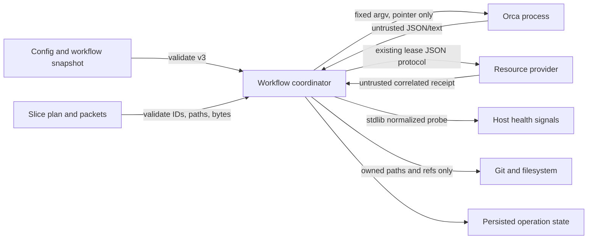

# Hybrid Slice Execution Threat Model

**Scope:** `.specs/features/hybrid-slice-execution/`
**Status:** Approved before implementation
**Surfaces:** S1, S6, S9, S10, S11

## System Boundary

The trusted core is the adopted workflow code in a clean repository checkout. It reads project-owned
configuration and feature artifacts, materializes slice packets, creates isolated Git worktrees,
invokes configured local executables and Orca, persists correlation state, integrates verified commits,
and cleans up only effects it owns.

Orca, the consumer resource-provider executable, their stdout/stderr, machine-health commands, feature
JSON, repository contents, filesystem paths, and interrupted prior state are untrusted at each read.
No network route, account, credential store, or browser data is introduced.

## Assets

| Asset | Required property |
| --- | --- |
| Integration checkout and Git refs | Never contaminated or removed by another slice's lifecycle. |
| Slice worktrees and commits | Bound to one repository, slice, operation, and verified checkpoint. |
| Worker packets | Complete on disk; never leaked through telemetry or truncated transport. |
| Operation and lease state | Correlated, restart-readable, and sufficient for same-effect reconciliation. |
| Consumer machine | Writer and heavy-gate concurrency remain within proved capacity and leases. |
| Consumer configuration | Preserved across adoption and rejected before effects when stale or malformed. |

## Actors and Capabilities

| Actor | Capability |
| --- | --- |
| Project maintainer | Edits repository config, tasks, and resource provider; can explicitly set lane cap. |
| Coordinator agent | Reads plans, starts approved effects, integrates verified commits, and requests cleanup. |
| Slice implementer | Writes only its assigned checkout and commits its sequential tasks. |
| Read-only role | Reads the integration checkout; cannot own a writer effect. |
| Faulty or hostile local provider | Emits malformed, stale, contradictory, oversized, or reused receipts and observations. |
| Faulty Orca transport | Truncates terminal text, loses responses, or exposes stale terminal/worktree observations. |
| Interrupted prior run | Leaves packets, state, refs, leases, terminals, or worktrees that resemble current effects. |

## Trust Boundaries

## Threats and Controls

| ID | Threat | Boundary | Control and required outcome | Test cases |
| --- | --- | --- | --- | --- |
| TM-01 | Long Orca text truncates or changes a worker packet | Core → Orca | Persist complete packet; send and assert pointer only | IT-006, SEC-005 |
| TM-02 | Timeout causes a second mutation for the same logical effect | Core ↔ Orca/provider/Git | Persist operation ID before mutation; mutate once; reconcile with bounded reads | IT-007, SEC-006 |
| TM-03 | Stale or reused receipt is accepted for another slice or repository | Provider/Orca → Core | Require exact repository, slice, handle, operation, commit, path, and lease correlation | IT-009, SEC-007 |
| TM-04 | Malicious config or JSON reaches subprocess/filesystem sinks | Config/state → Core | Version/type/bounds validation, repository containment, no symlink, fixed argv | UT-006, UT-007, SEC-001, SEC-002 |
| TM-05 | Cleanup removes another run's worker, worktree, branch, ref, or lease | State/Git → Core | Prove ownership and clean/integrated/stopped/released state before each destructive step | IT-010, SEC-008 |
| TM-06 | Health probe leaks process data or falsely authorizes excess lanes | Host → Core | Normalize/redact output; enforce freshness; malformed/unavailable evidence caps admission at two | UT-013, UT-014, SEC-003 |
| TM-07 | Competing heavy gates overcommit exclusive ports, DBs, browsers, CPU, or memory | Core ↔ Provider | Reuse correlated resource-provider leases; no parallel gate without required lease | IT-004, SEC-004 |
| TM-08 | Dirty integration tree or path overlap contaminates commits and gates | Git/plan → Core | Reject dirty baseline; serialize overlapping writers; verify checkpoint before consumers | UT-010, IT-003, SEC-009 |
| TM-09 | Adoption leaves both old and new skills, creating conflicting authority | Source → Consumer | Atomic hard cut; byte-identical installed manifest; old path absent | IT-013, SEC-010 |
| TM-10 | Telemetry or diagnostics expose packet bodies, secrets, env, terminal text, or home paths | Core → logs | Emit counts/enums/logical IDs only and test forbidden values | UT-004, SEC-011 |
| TM-11 | Author self-certifies a faulty slice or integrated feature | Role routing → Core | Immutable author identity; fresh Technical Verifier, Deep Review, and QA sessions | UT-016, IT-012 |

## Failure Policy

- Validation failure happens before the next external mutation.
- Mutating calls are never retried. Only bounded read-only inspection may repeat.
- Contradictory evidence is failure, not a majority vote.
- Unavailable health evidence affects only admission above two; it never kills healthy work.
- Cleanup stops at the first missing proof and reports exact unresolved residue.
- Diagnostics remain useful through logical IDs and counts without exposing raw payloads.

## Residual Risk

The fake-Orca gate proves workflow behavior against the recorded host contract but cannot prove a
future Orca release. The live-host scenario therefore remains `blocked-verify` until upstream support
exists and an independent human-scheduled session records current evidence. Provider-side bugs can
still deny progress; fail-closed correlation prevents them from authorizing unsafe effects.
