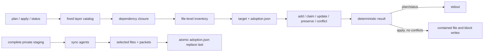

# Layered Workflow Adoption Design

**Spec**: `.specs/features/layered-workflow-adoption/spec.md`
**Surface**: `.specs/features/layered-workflow-adoption/dx.md`
**Status**: Approved

## Architecture Overview

Keep the adopter as one standard-library Python module. Fixed data tables define layer paths and dependencies; pure helpers resolve layers, expand source files, parse/validate the manifest, classify actions, and parse managed blocks. `plan` and `status` call those helpers without mutation. `apply` runs the same plan, rejects every conflict/unsafe path, builds a complete private target staging area, synchronizes packets against that staged target, then publishes selected files, generated packets, and the manifest last.

## Layer Catalog

| Layer | Managed paths | Missing-only paths | Depends on |
| --- | --- | --- | --- |
| `core` | guidelines/workflow docs, knowledge runtime/bundle, workflow-spec-driven, ponytail, workflow-config | ad-index, config example, agent templates | none |
| `parallel` | autonomous, QA pilot, Orca assisted probe | none | core |
| `quality` | deep-review, qa-plan, qa-execute | QA profile | core |
| `extras` | remaining ponytail skills | none | core |

`full` is parsed as the four layers, not stored as an installed layer.

## Components

### Layer resolver and inventory

- **Location**: `scripts/adopt.py`
- **Purpose**: Normalize selections, close the fixed DAG, expand directory entries to sorted file paths, and reject overlaps.
- **Reuse**: Current `COPY_PATHS`, `COPY_MISSING_PATHS`, root/path validation, Bun adoption inventory.

### Manifest and action classifier

- **Location**: `scripts/adopt.py`
- **Purpose**: Validate schema, exact JSON-key uniqueness, canonical path/hash ownership and classify each effective file without writing.
- **Rule**: A recorded managed file is writable only when current bytes equal `installed_sha256`; an unrecorded existing file is claimable only when equal to source.
- **Consumer ownership**: Missing-only destinations are preserved and recorded as `consumer`; status does not hash their whole content as workflow-managed.

### Managed instruction composer

- **Locations**: `scripts/adopt.py`, `templates/adoption/agents/{core,parallel,quality}.md`
- **Purpose**: Append or replace one exact block per selected layer while preserving all surrounding bytes. Existing consumer bytes remain an unchanged prefix; when they do not end in a newline, the adopter may append only the separator needed before its marker.
- **CLAUDE**: core block contains only `@AGENTS.md`; `--skip-agents` bypasses both files and their manifest block records.
- **Reuse**: Existing product prose extraction is removed; no stencil dependency remains.

### Apply coordinator

- **Location**: `scripts/adopt.py`
- **Purpose**: Convert a conflict-free plan into a complete private staging tree, synchronize there, then publish deterministic file/packet buckets and atomically replace the manifest last. All fallible live effects, including cleanup and managed links, precede that final manifest replace.
- **Failure boundary**: Validation and conflicts precede writes. Temporary files stay inside the target parent and are replaced atomically. No layer removal exists.

### Canonical tests

- **Location**: `scripts/test_adopt.py`, with package/active-authority assertions in `tools/shared/tests/{workflow-config,qa-skills}.test.ts` only when those suites already own the invariant.
- **Purpose**: Exercise the public CLI in disposable targets, including an existing-project journey.

## Data Model

The manifest shape is frozen in `dx.md`. File records are keyed by normalized relative path. Layer arrays follow catalog order. JSON is serialized with sorted keys, indentation, and trailing newline; unchanged serialized bytes are not rewritten.

## Error Handling Strategy

| Scenario | Handling | User impact |
| --- | --- | --- |
| Invalid args/layer/schema/path | exit 2 before target writes | caller corrects invocation/state |
| Managed/unowned collision | exit 1 with every conflict | caller reviews or restores ownership |
| Missing-only consumer file exists | preserve and report | project configuration survives |
| Agent sync precondition invalid | validate before selected writes | no partial installation |
| Sync/runtime failure after staging | discard staged outputs; retain prior manifest/target | prior adoption remains authoritative |
| Status drift | exit 1, read-only report | CI can block update |

## Risks & Concerns

| Concern | Location | Impact | Mitigation |
| --- | --- | --- | --- |
| Current directory replacement can erase consumer files | `scripts/adopt.py` copy flow | Data loss in existing projects | Expand and manage individual files; preserve unknown paths. |
| Instruction ownership is whole-file/stencil-based | `scripts/adopt.py` agents flow | Existing project adoption aborts or overwrites | Exact managed blocks with conflict detection. |
| Sync must observe selected staged files before publication | `scripts/adopt.py` main flow | Packets can describe stale templates or layers | Build the complete staging tree, synchronize there, publish managed files then packets, and publish the manifest last. |
| One core module concentrates writers | `scripts/adopt.py` | Parallel implementation conflicts | Execute core tasks sequentially; parallelize only independent review/QA roles. |

## Tech Decisions

| Decision | Choice | Rationale |
| --- | --- | --- |
| Layer model | Four fixed layers plus `full` profile | Small surface, no invalid arbitrary skill combinations. |
| Implementation shape | Keep one Python module | Existing adopter is cohesive; a plugin/module framework is unnecessary. |
| Update policy | Additive, conflict-safe, no removal | Meets existing-project need without destructive semantics. |
| Ownership | Per-file hashes plus managed block hashes | Enough proof for safe update/status with stdlib only. |
