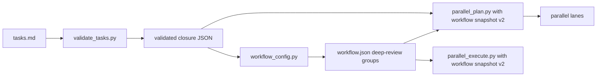

# Merge-Alone Slice Derivation Design

**Spec**: `.specs/features/merge-alone-slices/spec.md`
**Status**: Approved

## Approaches

| Approach | Trade-off | Decision |
| --- | --- | --- |
| Validator emits a deterministic JSON contract; resolver consumes it | Reuses the existing executable authority and adds one subprocess call during resolution | Chosen |
| Move parsing into a new shared library | Direct imports, but creates a new cross-skill module and adoption surface | Rejected as unnecessary |
| Parse closure data separately in each consumer | Fewest local edits, but recreates the drift that caused the issue | Rejected |

## Architecture Overview

One closure contract owns slice membership. Technical phases and worker batches remain downstream
organization and never contribute to the count.

Normal resume returns the valid snapshot before opening `tasks.md`. Initial resolution and explicit
refresh validate current tasks, derive `len(slice_ids)`, optionally compare `--slices`, then reuse
the existing balanced-group and atomic snapshot writer.

## Code Reuse Analysis

| Component | Location | Reuse |
| --- | --- | --- |
| Existing task field parser | `.agents/skills/tlc-spec-driven/scripts/validate_tasks.py` | Add `Slice` to the existing per-task field extraction. |
| Existing task slice parser | `.agents/skills/workflow-config/scripts/parallel_plan.py` | Keep reading `**Slice:**`; prove the closure table is ignored. |
| Existing parallel executor | `.agents/skills/workflow-config/scripts/parallel_execute.py` | Consume the same active workflow snapshot version as the resolver and planner. |
| Existing balanced cadence | `.agents/skills/workflow-config/scripts/workflow_config.py` | Feed it the validated derived count. |
| Existing atomic snapshot path | `.agents/skills/workflow-config/scripts/workflow_config.py` | Preserve resume and replacement semantics. |
| Existing Markdown fixtures | `tools/fixtures/tlc-validator/` | Add positive and negative closure contracts. |

## Components

### Validated closure contract

- **Location**: `.agents/skills/tlc-spec-driven/scripts/validate_tasks.py`
- **Purpose**: Parse primary task membership and the exact closure table, then validate their
  one-to-one consistency.
- **Interface**: `validated_slice_contract(tasks_path)` returns ordered `task_slices`, `slice_ids`,
  and `closures`; `--slice-contract-json` serializes the same value.
- **Rules**: Every `T\d+` task has one non-empty `Slice`; every used slice has one valid closure;
  duplicate/orphan rows fail; merge-alone is exact lowercase `yes`; remediation IDs do not count.

### Derived workflow resolution

- **Location**: `.agents/skills/workflow-config/scripts/workflow_config.py`
- **Purpose**: Select one slice when Tasks is absent or consume the validated closure count when it
  exists.
- **Interface**: `slice_count: int | None = None` remains the keyword/API assertion; CLI
  `--slices` is optional.
- **Ordering**: Existing snapshot resume returns first. Initial/refresh derives, compares the
  optional assertion, then writes through the existing atomic path.

### Planning template and guidance

- **Locations**: TLC task template, workflow-config skill, AGENTS/guidelines/workflow tour as needed.
- **Purpose**: Make merge-alone outcome, technical phase/cohort, and worker batch distinct at the
  decision point; route the resolver after validated Tasks.
- **Constraint**: Instruction word budget does not grow overall when AGENTS/guidelines change.

### Contract tests

- **Locations**: `tools/test_tlc_validators.py`, `tools/test_workflow_config.py`,
  `tools/test_parallel_plan.py`, canonical fixtures, and existing structural/adoption suites.
- **Purpose**: Prove exact validation, Praxis one-slice regression, two-slice delivery, assertion
  mismatch, no-Tasks default, resume/refresh ordering, and downstream parser alignment.

## Error Handling Strategy

| Error | Handling | Observable result |
| --- | --- | --- |
| Missing/invalid closure contract | Return validator errors with task/slice identity | Resolver exits before snapshot write |
| Optional count mismatch | Raise the existing configuration error type | Message includes supplied and derived values |
| No task document | Use derived count `1` | Existing resolution flow continues |
| Existing snapshot on resume | Validate and return snapshot before task access | No task-contract error or cadence change |

## Risks & Concerns

| Concern | Location | Impact | Mitigation |
| --- | --- | --- | --- |
| Existing feature task files predate the closure table | `.specs/features/*/tasks.md` | Revalidating or refreshing an old feature can fail | Intentional hard cut; normal resume remains snapshot-owned, and new/updated plans use the template. |
| Two downstream task readers exist | TLC validator and `parallel_plan.py` | Membership could drift | Keep the existing `**Slice:**` field as their shared input and add a no-regression planner test. |
| Historical version-1 snapshots remain tracked | `.specs/features/*/workflow.json` | Bulk rewriting would alter historical feature evidence | Keep historical files byte-for-byte; active consumers reject v1 and accept the resolver's v2 output. |
| Markdown table parsing is exact | validator | Helpful formatting variants may fail | Publish one canonical header and exact `yes`; errors name the field instead of guessing. |

## Tech Decisions

| Decision | Choice | Rationale |
| --- | --- | --- |
| Slice authority | Validated merge-alone closure contract | Count becomes a consequence of approved delivery units. |
| Missing Tasks | One slice | Auto-sized features have no multi-slice declaration. |
| Resume | Snapshot first, no task read | Preserves frozen routing and AC 6 from issue #71. |
| Optional manual count | Assertion on initial/refresh only | Detects expectation mismatch without restoring manual ownership. |
| Remediation records | Excluded from primary count | Review work is not a new mergeable product outcome. |
| Active workflow snapshot | Hard cut to version 2 | The resolver already emits v2; accepting v1 would restore compatibility explicitly rejected by AD-014. |
