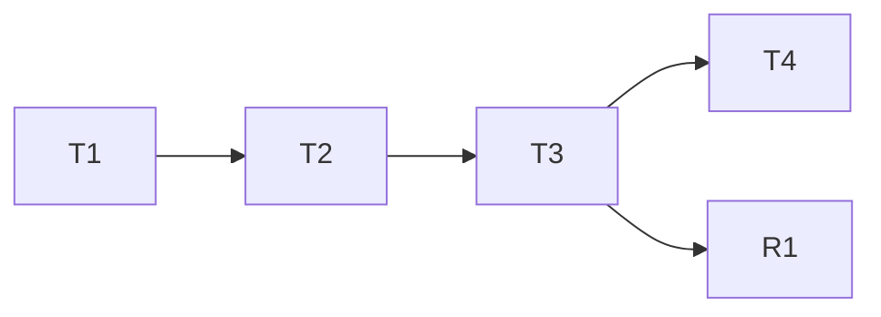

# Merge-Alone Slice Derivation Tasks

## Execution Protocol

1. Read `memory/MEMORY.md` before the first edit; update it before every commit.
2. Port rules from `git show 3ce7a2e:<old path>`; never paths, `tlc-spec-driven`, or schema-v2 checks.
3. One atomic Conventional Commit per task; the task gate is green before the commit.

**Design**: `.specs/features/merge-alone-slices/design.md`
**Status**: Done — Technical Verifier PASS at `ee895c6`; Deep Review and QA pending

## Vertical Slice Closure

| Slice | Observable outcome | Independent gate | Merge if later slices are cancelled? | Why |
| --- | --- | --- | --- | --- |
| A | `workflow_config.py` derives the slice count from a validated closure contract in `tasks.md`, `--slices` is an optional assertion, and the published template teaches the contract | `bun run test:all` | yes | One contract; a validator without a consumer or a consumer without a template is not usable alone |

## Test Coverage Matrix

> Generated from codebase, project guidelines, and spec. Guidelines found: `docs/guidelines/TEST-CONTRACT.md`, `docs/guidelines/GATES.md`, `bunfig.toml`.

| Code Layer | Required Test Type | Coverage Expectation | Location Pattern | Run Command |
| ---------- | ------------------ | -------------------- | ---------------- | ----------- |
| Task validator (`validate_tasks.py`) | unit | All closure and membership branches; 1:1 to spec ACs 3, 4, 10, 11; every listed edge case | `tools/test_tlc_validators.py`, `tools/fixtures/tlc-validator/*.md` | `python3 tools/test_tlc_validators.py` |
| Workflow resolver (`workflow_config.py`) | integration | Public CLI and `resolve()`: derive, assert, missing tasks, malformed, resume, refresh; snapshot bytes on every failure | `tools/test_workflow_config.py` | `python3 tools/test_workflow_config.py` |
| Parallel planner (`parallel_plan.py`) | integration | Membership equals the validator's; validator rejection fails closed | `tools/test_parallel_plan.py` | `python3 tools/test_parallel_plan.py` |
| Published contract (template, skill, README) | integration | Structural assertions on the shipped text | `tools/shared/tests/workflow-config.test.ts` | `bun test tools/shared/tests/workflow-config.test.ts` |
| QA scenario, journey, changelog | none | - (full gate only) | `docs/qa/**`, `CHANGELOG.md` | `bun run test:all` |

| Spec AC | Test IDs | Task |
| --- | --- | --- |
| 1, 2 | MAS-UT-001, MAS-UT-002, MAS-IT-001, MAS-IT-002 | T1, T2 |
| 3 | MAS-UT-003, MAS-UT-004 | T1 |
| 4 | MAS-UT-005, MAS-UT-006 | T1 |
| 5 | MAS-IT-003 | T2 |
| 6 | MAS-IT-004 | T2 |
| 7 | MAS-IT-005 | T2 |
| 8 | MAS-IT-006, MAS-IT-007 | T2 |
| 9 | MAS-IT-009 | T3 |
| 10 | MAS-UT-007 | T1 |
| 11, 12 | MAS-UT-008, MAS-IT-008, MAS-IT-011, MAS-IT-012 | T1, T3 |
| 13 | MAS-IT-010 | R1 |

## Gate Check Commands

| Gate | Command |
| --- | --- |
| Validator | `python3 tools/test_tlc_validators.py` |
| Resolver | `python3 tools/test_workflow_config.py` |
| Planner | `python3 tools/test_parallel_plan.py` |
| Contract | `bun test tools/shared/tests/workflow-config.test.ts` |
| Full | `bun run test:all` |

## Execution Plan

### Phase 1: Canonical Contract

- T1

### Phase 2: Resolver

- T2

### Phase 3: Published Contract

- T3, T4

## Task Breakdown

### T1: Validate Merge-Alone Slice Closures

**What**: Add exact `## Vertical Slice Closure` table parsing, one `**Slice:**` field per primary task, membership cross-checks, `validated_slice_contract(tasks_path)`, and `--slice-contract-json` to the shipped validator; restore the two fixtures.
**Where**: `.agents/skills/workflow-spec-driven/scripts/validate_tasks.py`; `tools/fixtures/tlc-validator/merge-alone-one-slice.md`; `tools/fixtures/tlc-validator/merge-alone-two-slices.md`; `tools/test_tlc_validators.py`
**Slice:** A
**Status:** complete
**Resources:** none
**Depends on:** None
**Reuses**: `parse_tasks`, `TASK_RE` (already excludes `T2R1`), `check`; old rules at `git show 3ce7a2e:.agents/skills/tlc-spec-driven/scripts/validate_tasks.py` and the fixtures at the same commit
**Requirement**: MAS-01, MAS-02, MAS-03, MAS-04, MAS-10, MAS-11

**Done when**:

- [x] Every primary `T\d+` task has exactly one non-empty `**Slice:**` field; any other spelling of the field fails with the task id.
- [x] Every used slice has one complete closure row with exact lowercase `yes`; duplicate, orphan, missing, and inconsistent records fail naming the task or slice.
- [x] `check()` reports closure errors alongside its existing errors; a `tasks.md` without the section fails.
- [x] `--slice-contract-json` prints deterministic JSON (`task_slices`, `slice_ids`, `closures`) in document order.
- [x] `scripts/test_adopt.py` and `bun test tools/shared/tests/qa-skills.test.ts` still pass with the shipped validator.

**Tests**: MAS-UT-001, MAS-UT-002, MAS-UT-003, MAS-UT-004, MAS-UT-005, MAS-UT-006, MAS-UT-007, MAS-UT-008
**Gate**: Validator
**Commit**: `feat(workflow): validate merge-alone slice closures`

### T2: Derive the Workflow Slice Count

**What**: Make `resolve()` derive the count through the validator's JSON contract, default to one slice without `tasks.md`, treat `--slices` as an optional exact assertion on initial and refresh paths, keep resume snapshot-first, and fail before any snapshot write.
**Where**: `.agents/skills/workflow-config/scripts/workflow_config.py`; `tools/test_workflow_config.py`
**Slice:** A
**Status:** complete
**Resources:** none
**Depends on:** T1
**Reuses**: `balanced_groups`, `_write_snapshot`, `_error`, the resume branch; old `_derived_slice_count` at `git show 3ce7a2e:.agents/skills/workflow-config/scripts/workflow_config.py`
**Requirement**: MAS-01, MAS-02, MAS-05, MAS-06, MAS-07, MAS-08

**Done when**:

- [x] `slice_count` is optional in `resolve()` and `--slices` is optional on the CLI; `--feature` and `--native-provider` stay required.
- [x] Praxis fixture derives one slice, two-capability fixture derives two, no `tasks.md` derives one.
- [x] Mismatched, zero, or negative `--slices` and a malformed `tasks.md` exit non-zero naming the cause, with no snapshot written and an existing snapshot byte-identical.
- [x] Resume returns the frozen snapshot without reading `tasks.md`; `--refresh` re-derives and replaces atomically with the same schema.
- [x] Existing resolver tests that passed `--slices` still pass unchanged where their fixtures carry no `tasks.md`.

**Tests**: MAS-IT-001, MAS-IT-002, MAS-IT-003, MAS-IT-004, MAS-IT-005, MAS-IT-006, MAS-IT-007
**Gate**: Resolver
**Commit**: `feat(config): derive slice count from merge-alone outcomes`

### T3: Publish the Slice Planning Contract

**What**: Teach the contract in the task template, the workflow-config skill, and the README; prove the planner reports the validator's membership.
**Where**: `.agents/skills/workflow-spec-driven/references/tasks.md`; `.agents/skills/workflow-config/SKILL.md`; `README.md`; `tools/test_parallel_plan.py`; `tools/shared/tests/workflow-config.test.ts`
**Slice:** A
**Status:** complete
**Resources:** none
**Depends on:** T2
**Reuses**: Old template text at `git show 3ce7a2e:.agents/skills/tlc-spec-driven/references/tasks.md` § Vertical Slice Closure; `parallel_plan.plan`; the old `publishes the merge-alone slice planning contract` structural test
**Requirement**: MAS-09, MAS-11, MAS-12

**Done when**:

- [x] Template adds `## Vertical Slice Closure` before Task Breakdown and `**Slice:** [id]` to every example task; it defines slice, phase/cohort, and batch without overlapping ownership.
- [x] Skill and README resolver examples omit `--slices` or show it only as an optional assertion.
- [x] `parallel_plan.plan` on the resolved two-slice fixture reports membership equal to `validated_slice_contract(...)["task_slices"]`.
- [x] Instruction-file net line count does not grow (`docs/guidelines/CONTEXT-BUDGET.md`).

**Tests**: MAS-IT-008, MAS-IT-009
**Gate**: Planner; Contract
**Commit**: `docs(workflow): publish merge-alone slice contract`

### T4: Promise Derived Slices to Adopters

**What**: Mint one new CFG scenario for the derived-count promise, link it from the configure-workflow journey, and record the change under `## [Unreleased]`.
**Where**: `docs/qa/scenarios/CFG-derive-merge-alone-slices.md`; `docs/qa/journeys/J-configure-feature-workflow.md`; `CHANGELOG.md`
**Slice:** A
**Status:** complete
**Resources:** none
**Depends on:** T3
**Reuses**: Scenario frontmatter shape from `docs/qa/scenarios/QAS-run-the-gate-when-the-cache-cannot-vouch.md`; existing `## [Unreleased]` section
**Requirement**: MAS-01, MAS-05, MAS-08, MAS-09

**Done when**:

- [x] New scenario has `qa_status: untested`, names the resolver entry points, and states the derived count, assertion, and frozen-resume promise.
- [x] No existing `docs/qa/scenarios/*` file changes (`IT-006` frozen baseline).
- [x] `## [Unreleased]` records the derived slice count and the optional `--slices` assertion.
- [x] Full gate exits zero.

**Tests**: none — matrix layer "QA scenario, journey, changelog" requires none; owned by the full gate
**Gate**: Full
**Commit**: `docs(qa): promise merge-alone slice derivation`

### R1: Ignore Remediation Records in the Planner

**What**: Reset the planner's current task on any heading line, as the validator does, so a `T<n>R<m>` record donates no `Status`, `Resources`, or `Depends on` to the primary task above it.
**Where**: `.agents/skills/workflow-config/scripts/parallel_plan.py`; `tools/test_parallel_plan.py`
**Slice:** A
**Status:** complete
**Resources:** none
**Depends on:** T3
**Requirement**: MAS-13

**Done when**:

- [x] A `### T2R1:` record after `T2` with `**Status:** complete`, `**Resources:** db`, `**Depends on:** T3` leaves `T2`'s plan identical to the document without the record.
- [x] The test fails on the pre-fix parser (record it) and passes after.

**Tests**: MAS-IT-010
**Gate**: Planner
**Commit**: `fix(workflow): ignore remediation records in the planner`

## Dependency Execution Map

