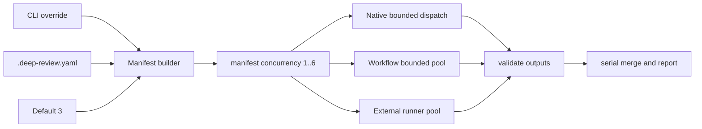

# Parallel Deep Review Design

**Spec**: `.specs/features/parallel-deep-review/spec.md`
**Status**: Approved

## Architecture Overview

`build_manifest.py` remains the single repository-config reader. It resolves concurrency with
precedence `CLI > .deep-review.yaml > 3`, validates `1..6`, and pins the value in `manifest.json`.
Every execution engine consumes that pinned value, so native, Workflow fallback, Agent fallback,
and external runtimes share one decision without duplicating YAML parsing.

## Components

### Manifest configuration

- **Location**: `.agents/skills/deep-review/scripts/build_manifest.py`
- **Purpose**: parse and freeze concurrency once.
- **Interface**: `--concurrency N`; `.deep-review.yaml` scalar `concurrency`.
- **Rule**: reject invalid values before prompts or jobs are dispatched.

### External bounded scheduler

- **Location**: `.agents/skills/deep-review/scripts/run_jobs.py`
- **Purpose**: maintain at most N active job futures.
- **Algorithm**:
  1. Load pending jobs in manifest order and compute `min(manifest concurrency, pending count)`.
  2. Submit only enough jobs to fill the pool.
  3. On ordinary completion or failure, record by label and schedule the next pending job.
  4. On provider block, atomically preserve the first reason and stop scheduling; active jobs finish.
  5. Sort final status by jobs-file order, then apply existing exit and freeze rules.
- **Retries**: stay synchronous inside a worker, so an attempt never expands concurrency.

### Native and fallback orchestration

- **Location**: deep-review `SKILL.md`, `references/orchestration.md`, and
  `references/subagent-runtimes.md`.
- **Purpose**: specify the same bounded scheduler for hosts outside `run_jobs.py`.
- **Rule**: launch up to N pending jobs, refill on completion, stop refilling after a classified
  provider block, preserve valid artifacts, then run `--validate-only`.

### Metrics

- **Location**: existing metrics hooks in `run_jobs.py`.
- **Purpose**: preserve cumulative provider usage.
- **Rule**: the main thread writes checkpoints after completed futures using a monotonic completion
  counter. Checkpoints and final totals never claim job ownership. Failed, blocked, or incomplete
  scopes remain unfinalized.

## Error Handling Strategy

| Condition | Behavior |
| --- | --- |
| Invalid concurrency | Reject before dispatch. |
| Ordinary job failure | Record failure; continue siblings and pending jobs. |
| Provider block | Preserve first reason, stop new scheduling, active jobs finish, exit `2`. |
| Source drift | Active jobs finish, post-run freeze check exits `3`. |
| Metrics failure | Record unavailable/non-blocking state; review execution continues. |
| Invalid output | Retry inside the owning worker; preserve independent siblings. |

## Risks & Concerns

| Concern | Mitigation |
| --- | --- |
| Burst rate limits | Default `3`; `6` requires explicit config or CLI. |
| Nondeterministic completion order | Store results by label; render in manifest order. |
| Conflicting block reasons | Lock first writer; later blocks do not replace it. |
| Misleading token attribution | Keep cumulative totals only. |
| Duplicate config parsers | Resolve concurrency only in manifest builder. |

## Tech Decisions

| Decision | Choice | Rationale |
| --- | --- | --- |
| Default | `3` | Balanced wall time and burst risk. |
| Maximum | `6` | User-approved deliberate fan-out bound. |
| Auto mode | None | Provider capacity is not reliably observable. |
| Legacy `--workers` | Remove | It is currently a silent no-op; compatibility would preserve ambiguity. |
