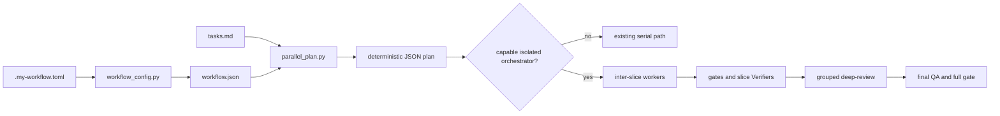

# Parallel Slice Dispatch Design

**Spec:** `.specs/features/parallel-slice-dispatch/spec.md`
**Status:** Approved for autonomous execution

## Architecture Overview

The workflow-config resolver freezes one parallelization mode. A new read-only planner parses the
versioned task graph and emits a deterministic point-in-time projection. Autonomous consumes that
projection only when its orchestrator can isolate worktrees and runtimes; otherwise it follows the
existing serial path. TLC remains unchanged inside each slice.



Approaches considered:

| Approach | Decision | Reason |
| --- | --- | --- |
| Documentation-only policy | Rejected | It cannot validate a DAG or prove fallback behavior. |
| Configured deterministic plan | Selected | It is portable, testable, opt-in, and leaves TLC untouched. |
| Generic worktree and agent executor | Deferred | The repository has no provider-independent spawn/runtime API. |

## Code Reuse Analysis

### Existing Components to Leverage

| Component | Location | How to use |
| --- | --- | --- |
| Workflow snapshot resolver | `.agents/skills/workflow-config/scripts/workflow_config.py` | Reuse strict TOML parsing, atomic snapshots, and resume semantics. |
| TLC task validator | `.agents/skills/tlc-spec-driven/scripts/validate_tasks.py` | Run before planning; do not change its format or execution contract. |
| Workflow-config test harness | `tools/test_workflow_config.py` | Extend its temporary-repository fixtures. |
| Autonomous serial loop | `.agents/skills/autonomous/SKILL.md` | Keep as fallback and add one conditional dispatch seam. |

### Integration Points

| System | Integration method |
| --- | --- |
| Feature workflow snapshot | Read frozen `parallelization.mode` from `workflow.json`. |
| Feature task state | Parse existing fields plus optional `Slice`; absence disables concurrency. |
| Capable orchestrator | Consume plan, own worktrees, checkpoints, worker lifecycle, and follow-up. |
| Review workflow | Freeze final/group trees before Verifier or deep-review; repeat invalidated evidence. |

## Components

### Parallelization configuration

- **Purpose:** Validate and freeze `disabled`, `safe`, or `full`.
- **Location:** `.agents/skills/workflow-config/scripts/workflow_config.py`
- **Interface:** Existing resolver CLI and `workflow.json` snapshot gain `parallelization.mode`.
- **Dependencies:** Existing TOML and atomic write helpers.
- **Reuses:** Current strict configuration schema.

### Parallel plan generator

- **Purpose:** Project current task state into ready, blocked, checkpoint, or serial-fallback output.
- **Location:** `.agents/skills/workflow-config/scripts/parallel_plan.py`
- **Interface:** `--root`, `--feature`, optional `--verified-slice`; JSON on stdout.
- **Dependencies:** Frozen `workflow.json`, versioned `tasks.md`, Git HEAD, TLC validator.
- **Reuses:** Standard library only.

The planner adds only optional `**Slice:** <id>` metadata. It uses existing `Status`, `Where`, and
`Depends on` fields. Missing slice metadata or ambiguous `Where` values force serial fallback.

Mode rules:

| Mode | Candidate rule |
| --- | --- |
| `disabled` | One serial lane in declared order. |
| `safe` | First incomplete task per slice; cross-slice producers must be declared verified. |
| `full` | First incomplete task per slice; completed cross-slice task dependencies become sync checkpoints. |

### Autonomous dispatch contract

- **Purpose:** Tell a capable Planner when to dispatch, wait, follow up, synchronize, or fall back.
- **Location:** `.agents/skills/autonomous/references/parallelization.md`
- **Interface:** Mode gate, worker result envelope, dependency event, checkpoint and invalidation rules.
- **Dependencies:** Current autonomous serial loop and provider-specific orchestration capability.
- **Reuses:** Existing worker summary and review contracts.

## Data Models

```text
Plan {
  version, feature, mode, source_git_head,
  fallback, lanes[], blocked[], reasons[]
}

Lane { id, slice, task, status, sync_after[] }
Blocked { task, slice, reasons[] }
```

JSON arrays and object keys use fixed ordering. The planner writes no file and mutates no Git state.

## Error Handling Strategy

| Error scenario | Handling | Workflow impact |
| --- | --- | --- |
| Invalid configured mode | Resolver exits non-zero before atomic replacement. | Existing snapshot remains valid. |
| Missing or malformed task metadata | Emit serial fallback with reason. | Existing serial execution continues. |
| Cycle or unknown dependency | Emit serial fallback with all decisive graph errors. | No parallel worker starts. |
| Write-path collision | Emit serial fallback naming the colliding tasks. | Conflicting tasks execute serially. |
| Missing isolated executor | Ignore concurrent lanes and use serial path. | No worktree or worker is created. |
| Worker waits on unfinished dependency | Persist clean checkpoint, end turn, follow up on completion event. | No polling token cost. |
| Rebase or integration changes tree | Rerun affected gate and invalidate later evidence. | Readiness waits for fresh evidence. |

## Risks & Concerns

| Concern | Location | Impact | Mitigation |
| --- | --- | --- | --- |
| Current task format lacks slice identity. | `.agents/skills/tlc-spec-driven/references/tasks.md` | Planner cannot prove inter-slice readiness. | Accept optional `Slice` only in the additive parser; missing metadata falls back. |
| The repository has no generic agent runtime. | `.agents/skills/autonomous/SKILL.md` | A script cannot safely spawn or monitor providers. | Emit plan only; capable orchestrator owns mutations. |
| `AD-003` contradicts current versioned spec policy. | `.specs/STATE.md` | Future agents may ignore durable workflow state. | Supersede it with a new decision and regenerate the index. |
| Two lanes may update `tasks.md`. | `.specs/features/<feature>/tasks.md` | Rebase conflict or lost status. | Each worker edits only its task block; coordinator serializes reconciliation. |
| Full gates can contend. | `docs/guidelines/GATES.md` | False failure or resource collapse. | Executor queues full gates unless runtimes are proven isolated. |

## Tech Decisions

| Decision | Choice | Rationale |
| --- | --- | --- |
| Execution boundary | Parallelization sits above TLC. | Preserves the proven sequential task contract. |
| Safety posture | Opt-in with automatic serial fallback. | No feature pays reliability for unavailable concurrency. |
| Planner source | Versioned `tasks.md`; no duplicate manifest. | Avoids drift and extra state. |
| Worker waiting | Turn ends; follow-up resumes the same worker context when possible. | Eliminates LLM polling cost. |
| Synchronization | Dependency checkpoints plus final reconciliation if needed. | Avoids per-task rebase churn. |
