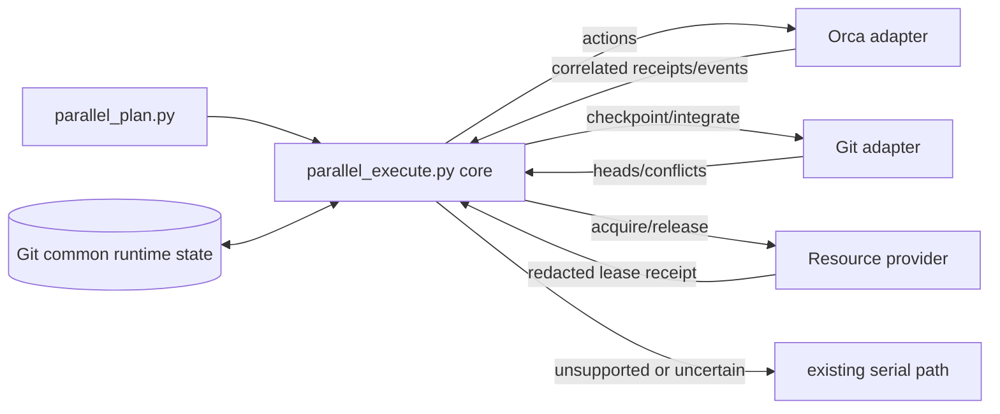

# Parallel Slice Executor Design

**Spec:** `.specs/features/parallel-slice-executor/spec.md`
**Status:** Approved for autonomous execution

## Architecture Overview

Extend the existing deterministic planner with a deterministic executor core. The core owns state,
idempotency, action selection, and fallback. Small adapters own external effects: Orca for worktrees,
workers, and events; Git for checkpoint/integration operations; a consumer executable for runtime
resources. Runtime receipts are atomic local Git state, not versioned feature truth.



Approaches considered:

| Approach | Decision | Reason |
| --- | --- | --- |
| Agent instructions directly issue Git and Orca commands | Rejected | Policy, restart idempotency, and receipt correlation would depend on prompt interpretation. |
| One monolithic Orca executor | Rejected | It would couple scheduling and resource policy to one IDE and make conformance tests infrastructure-dependent. |
| Deterministic core with narrow effect adapters | Selected | It is testable with stdlib fakes, keeps Orca replaceable, and centralizes fail-closed transitions. |

## Code Reuse Analysis

### Existing Components to Leverage

| Component | Location | How to use |
| --- | --- | --- |
| Point-in-time planner | `.agents/skills/workflow-config/scripts/parallel_plan.py` | Continue using its lanes, `sync_after`, blocked reasons, and frozen source head. |
| Workflow resolver | `.agents/skills/workflow-config/scripts/workflow_config.py` | Freeze the optional provider path without creating a second config reader. |
| Autonomous policy | `.agents/skills/autonomous/references/parallelization.md` | Replace the abstract capable-executor seam with the executable entry and recovery rules. |
| Python workflow tests | `tools/test_parallel_plan.py`, `tools/test_workflow_config.py` | Reuse temporary Git repositories and direct-function test style. |
| Orca orchestration | Public `orca orchestration` CLI | Use run/task/worker/event receipts; do not parse terminal prose as state. |

### Integration Points

| System | Integration method |
| --- | --- |
| Frozen workflow | Executor reads `workflow.json`; current mode and optional provider path are authoritative. |
| Versioned tasks | Planner exposes one task per slice plus explicit `Resources` metadata. |
| Orca | Adapter executes fixed argv and validates JSON receipts from worktree/worker/event commands. |
| Git | Adapter acts only in validated clean worktrees and returns exact pre/post HEADs. |
| Review workflow | Core marks changed-head evidence invalid; autonomous dispatches existing Verifier/deep-review stages. |

## Components

### Executor core

- **Purpose:** Reconcile plan, local receipts, and adapter events into the next deterministic effects.
- **Location:** `.agents/skills/autonomous/scripts/parallel_execute.py`
- **Interfaces:** `start`, `resume`, `status`; `Coordinator.transition(state, event) -> actions`.
- **Dependencies:** Standard library and `parallel_plan.py`.
- **Reuses:** Existing plan and serial fallback vocabulary.

State is written atomically below `git rev-parse --git-common-dir` under a repository-identity key.
Before replacement the core validates the real Git directory, rejects symlinks in the owned state
path, fsyncs the temporary file, and renames it within the same directory.

### Orca adapter

- **Purpose:** Materialize validated worktrees/workers and translate Orca events into core receipts.
- **Location:** `.agents/skills/autonomous/scripts/orca_adapter.py`
- **Interfaces:** `create_worktree`, `start_worker`, `read_worker`, `wait_events`, `follow_up`, `release`.
- **Dependencies:** Orca CLI contract `orchestration.contract.v1`; fixed subprocess argv.
- **Reuses:** Orca idempotency keys, run/task/dispatch/terminal ownership, and blocking `check --wait`.

Worktree creation is separate from worker start so a resource provider can prepare the checkout before
the worker sees it. The adapter accepts one Orca JSON schema; unknown/missing fields are failures.

### Git adapter

- **Purpose:** Synchronize one exact producer checkpoint and integrate verified slice branches.
- **Location:** `.agents/skills/autonomous/scripts/git_adapter.py`
- **Interfaces:** `sync_checkpoint`, `integrate_slice`, `head`, `is_clean`.
- **Dependencies:** Git CLI through fixed argv.
- **Reuses:** Existing branch/worktree and evidence guidelines.

Checkpoint sync rebases only a private dependent lane. It records pre-HEAD, exact producer commit,
post-HEAD, and changed paths. A conflict runs `rebase --abort` and verifies the original clean HEAD.
Verified slice integration uses a merge on the feature branch, preserving reviewed commit IDs. A
merge conflict runs `merge --abort` and returns serial recovery.

### Resource provider

- **Purpose:** Let each consuming project allocate its actual runtime, port, and database namespace.
- **Location:** provider executable frozen by `workflow_config.py`; protocol enforced by the core.
- **Interfaces:** JSON `acquire` and `release` requests on stdin; one JSON receipt on stdout.
- **Dependencies:** Consumer-owned implementation.
- **Reuses:** Explicit `Resources` task metadata and core idempotency keys.

The core persists lease identifiers, resource names, preparation status, and redacted environment
keys only. Provider output never becomes shell input. `Resources: none` bypasses acquisition; missing
metadata or a resource-bearing lane without a provider serializes.

## Data Models

```text
RuntimeState {
  version, repository_id, feature, mode, source_git_head,
  lanes: { slice_id: LaneReceipt }, actions: { idempotency_key: ActionReceipt }
}

LaneReceipt {
  slice, task, state, worktree_id, worktree_path, branch,
  run_id, orchestration_task_id, dispatch_id, terminal_handle,
  pre_head, current_head, lease, invalidated_evidence[], fallback_reason
}

ActionReceipt {
  key, action, status, request_fingerprint, external_id, created_at, completed_at
}

LeaseReceipt {
  lease_id, resources[], prepared_worktree, environment_keys[], released
}
```

The core accepts only these states:

```text
ready -> needs_resources -> running -> waiting -> needs_sync -> running -> complete
   \            \            \          \            \             \
    +------------+------------+----------+------------+-------------> serial|failed
```

## Error Handling Strategy

| Error scenario | Handling | Workflow impact |
| --- | --- | --- |
| Disabled/unsupported adapter | Emit serial result without adapter construction. | Existing serial path continues. |
| State or receipt identity mismatch | Reject before next effect; retain evidence. | Lane serializes with exact reason. |
| Missing resource provider | Permit only explicit `Resources: none`; reject resource-bearing lane. | No unisolated runtime starts. |
| Orca timeout with no event | Return unchanged state. | Coordinator can continue waiting without a model poll. |
| Dirty worktree or Git conflict | Abort Git operation and verify prior clean HEAD. | Serial recovery owns resolution. |
| HEAD changed by sync | Mark affected receipts invalid and require scoped gate. | Prior evidence cannot unlock a task. |
| Cleanup failure | Persist unreleased ownership and halt. | No other lane may reuse the lease/terminal. |

## Risks & Concerns

| Concern | Location | Impact | Mitigation |
| --- | --- | --- | --- |
| Planner does not expose resource metadata. | `.agents/skills/workflow-config/scripts/parallel_plan.py` | Executor cannot prove whether a lane needs isolation beyond a checkout. | Parse explicit `Resources`; missing/ambiguous values cause serial fallback. |
| Orca advertises ports but has no public reservation verb. | Orca 1.4.188 CLI schema | Claiming native port/DB isolation would be false. | Consumer provider contract; real pilot is resource-free and limitation is recorded. |
| Runtime receipts contain host-specific IDs. | `.specs/features/` is versioned by `AD-007`. | Committing them would leak environment state and conflict across checkouts. | Store under Git common state; persist only redacted data. |
| Rebase rewrites a consumer lane. | Dependent slice worktree | Earlier verification could become stale. | Rebase only at declared checkpoint and invalidate every affected receipt. |
| Multiple producer branches may be incomparable. | Full-mode `sync_after` | An arbitrary rebase order could drop or misorder work. | Serialize when more than one exact producer is not already ancestor-related. |
| Full gates contend across worktrees. | `docs/guidelines/GATES.md` | Machine saturation or false failures. | Executor parallelizes slice tasks, not shared full gates; resource provider must isolate scoped runtimes. |

## Tech Decisions

| Decision | Choice | Rationale |
| --- | --- | --- |
| Policy/effect split | Deterministic core plus narrow adapters | Keeps failure semantics stable across IDEs. |
| First provider | Orca adapter | Its current public CLI proves the required worker lifecycle. |
| Local recovery state | Git common directory | Survives reboot, stays repository-scoped, and never pollutes versioned specs. |
| Resource integration | Consumer executable, fixed JSON protocol | Projects control real runtime/DB semantics without a speculative plugin framework. |
| Checkpoint reconciliation | Rebase dependent private lane | The consumer sees the exact producer before its dependent task. |
| Final slice integration | Merge verified slice | Preserves commit identity and review evidence. |

The policy/effect boundary and fail-closed provider rule are durable project decisions recorded as
`AD-010` in `.specs/STATE.md`.
