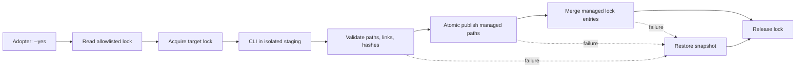

# External Security Skills Threat Model

**Scope:** the explicit external-security-skills installation step in this feature.

**Focus paths:** `scripts/adopt.py`, `scripts/install_security_skills.py`, `skills-lock.json`,
the consumer's `skills-lock.json`, `.agents/skills/<managed-skill>/`,
`.claude/skills/<managed-skill>/`, the target-local installation lock, and the staging directory
created beside the target.

## Assumptions and deployment context

- The installer runs as the adopting developer's local process against a disposable or existing
  consumer checkout. The consumer may contain product-owned files that this workflow does not own.
- The external `skills` CLI and its Git fetches are the only network-capable dependency. Adoption
  itself does not invoke it; the user must explicitly run the printed `--yes` command.
- The CLI operates in an installer-created staging directory. Its output is untrusted until path,
  tree-hash, link, provenance, and target-boundary checks pass.
- The user-authorized active host npx and git toolchain is discovered from the original caller
  PATH before child scrubbing. Candidate paths and resolved realpaths must remain outside the
  consumer target, staging root, and workflow pack/repository root; only fixed system roots are
  fallback when no active candidate exists. The candidate is validated through its realpath but
  the original absolute candidate is executed so mise/asdf/Homebrew shims retain argv[0] dispatch.
- No credentials, cookies, tokens, or product data are required by the installer or stored in its
  committed artifacts.

## Trust boundaries and assets

| Boundary | Untrusted side | Trusted decision point |
| --- | --- | --- |
| B1 | Adopter arguments and inherited environment | `argparse`, resolved target, and scrubbed child environment |
| B2 | External repository and `skills` CLI output | Lock allowlist, staging, no-follow validation, and tree hash |
| B3 | Staging publication into the consumer checkout | Target lock, snapshots, descriptor-relative opens, atomic replace, and rollback |

Assets are the consumer's unrelated files and lock entries, the three managed skill trees, Claude
links, reviewed provenance (`source`, `sourceType`, `skillPath`, `cliVersion`, `ref`, and
`computedHash`), and the availability state of the security gate.

## Threats and controls

| ID | Threat and path | Control | Residual |
| --- | --- | --- | --- |
| TM-001 | A caller-controlled executable, staged path, hardlink, special file, or inherited target variable redirects writes outside the consumer: B1 → B2 → B3. | Resolve user-authorized npx and git from the original PATH before scrubbing; reject lexical candidates or resolved targets inside target, staging, or pack/repository roots; execute the original validated candidate path (preserving shim argv[0]); pass only the deduplicated validated candidate/resolved parent dirs plus fixed system dirs; remove `MY_WORKFLOW_TARGET` and credentials; reject every `.git`, `node_modules`, symlink, special file, and hardlinked regular file before hash/publication; open target components with `O_NOFOLLOW`. | The user-authorized external host toolchain remains trusted; a compromised toolchain itself is outside this workflow's control. |
| TM-002 | A failed or interrupted publication leaves partial skills, links, or lock state and damages consumer data: B2 → B3. | Per-target lock; snapshot managed paths on the target filesystem; atomic descriptor-relative replacement; verify before and after publication; restore all affected paths on failure. | A process killed after the last write and before rollback is outside the in-process recovery guarantee; rerun the installer after inspecting the target. |
| TM-003 | Source, path, CLI version, commit, or content is substituted for reviewed security guidance: B2. | `skills-lock.json` allowlists exact repositories, source types, paths, `cliVersion`, 40-hex refs, and 64-hex tree hashes; reject `latest` and mismatches before publication. | Reviewed upstream content can still contain an undiscovered defect; independent security review remains required. |
| TM-004 | Two installers race, or a stale lock blocks recovery, causing one transaction to undo another: B3. | Atomic target-local lock with owner PID/token; stale-owner recovery; the lock spans staging, publication, verification, lock merge, and rollback. | PID reuse or abrupt host failure can require manual inspection before retrying. |

## Compact flow

## Residual focus for review

Review the boundary between the external CLI and staging, the descriptor-relative publication and
rollback paths, the exact lock-entry merge, and the target-local concurrency lock. The feature's
`SEC-001` through `SEC-005` tests cover the declared filesystem, provenance, content-integrity,
metadata-substitution, and active-toolchain boundary abuse cases.
