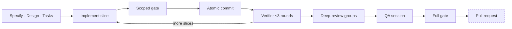

# my-workflow

An operating system for agents. It increments [`tlc-spec-driven`](https://github.com/tech-leads-club/agent-skills/tree/main/skills/tlc-spec-driven)
with a capped delivery loop, countable tests and security surfaces, and a knowledge bundle. It is
not a product template and not a stack starter.

The design problem is the usual one: **ship, without lying about quality**. Unbounded review feels
responsible and never finishes. A green suite with no spec contract ships bugs. This pack picks a
middle: small vertical slices, cheap gates while building, a hard cap on review rounds, and a
human-owned merge.

Start here: **[docs/workflow/](docs/workflow/)** — an index of every stage, guideline, and choice.
Release history: [`CHANGELOG.md`](CHANGELOG.md).

## Purpose

| Delivery | Reliability |
| --- | --- |
| Auto-sized planning (one line needs no spec) | Tests assert spec outcomes, not the implementation |
| Scoped gate per slice; full gate once | Never weaken a test to go green |
| Nitpicks become filed issues, not extra rounds | Blocker and Major still hold the ship |
| `ponytail` at `full` — shortest code that works | Security surfaces declared and given `SEC-` ids |
| Human schedules remote delivery | Readiness is evidence, not authorization; push, pull request, merge, and deploy each need an explicit go-ahead |

The loop, the caps, and the guidelines are the mechanism. The tour explains **why** each exists.
`AGENTS.md` is what agents run.

## Adopt the workflow

Copy the loop, not the product. For a new project, replace the stencil paragraph under **What this
project is** in `AGENTS.md` and fill product documentation only as the product earns it. For an
existing project, preserve its filled product paragraph and product-owned documentation.

```bash
python3 scripts/adopt.py /path/to/target-project
```

For an existing project with a filled product paragraph, pass `--skip-agents` to preserve
`AGENTS.md` and `CLAUDE.md` byte-for-byte while installing the rest of the workflow:

```bash
python3 scripts/adopt.py --skip-agents /path/to/target-project
```

This is an explicit opt-in. It skips only the two agent instruction files; merge the workflow loop
into `AGENTS.md` and update `CLAUDE.md` manually later.

Prerequisites: the target directory must already exist, and `adopt.py` requires Python 3. Adoption
does not require a Git `HEAD`. Before running the workflow-config resolver, the target must be a Git
repository with at least one commit. Node.js and npm are needed only to validate this source pack's
gates, not to adopt it.

Adoption is a review before it is a command. [`docs/adoption-prompt.md`](docs/adoption-prompt.md)
carries the prompt that walks an agent through the read-only inspection, the script, and the diff.

## Update an adopted project

`adopt.py` is the update mechanism. It is idempotent: re-running it replaces the managed paths with
this pack's current version and leaves product-owned files alone.

```bash
cd /path/to/target-project
git status --short                       # start from a clean tree
git switch -c chore/update-my-workflow

python3 /path/to/my-workflow/scripts/adopt.py --skip-agents .
git diff                                 # review before accepting
```

Commit first, always: managed directories are deleted before being rewritten, so anything the
project added inside one — `knowledge/wiki/` concepts especially — is gone if it is not in Git.

Use `--skip-agents` whenever the target's product paragraph is filled — which is every project past
its first day. That flag leaves `AGENTS.md` and `CLAUDE.md` untouched, so changes to the delivery
loop itself do not arrive. Check for them, then merge by hand:

```bash
diff /path/to/my-workflow/AGENTS.md /path/to/target-project/AGENTS.md
```

Read [`CHANGELOG.md`](CHANGELOG.md) between the version the project adopted and this one to know
what the update carries. The pack version is `package.json`'s `version`.

## What lands in your repo

| Path | On adopt and every update |
| --- | --- |
| `docs/guidelines/`, `docs/workflow/` | **Replaced.** Workflow-owned. |
| `.agents/skills/` — `tlc-spec-driven`, `deep-review`, `ponytail*`, `qa-plan`, `qa-execute`, `autonomous`, `workflow-config` | **Replaced.** |
| `knowledge/AGENTS.md`, `knowledge/raw/README.md` | **Replaced.** Your own `knowledge/raw/` entries are untouched. |
| `knowledge/wiki/` | **Replaced — the directory is deleted first.** Concept files a project wrote there do not survive an update. Back the directory up, or commit it, before re-running. |
| `tools/knowledge/`, `tools/shared/src/frontmatter.ts` and its test | **Replaced.** |
| `.claude/skills/` | **Relinked** — symlinks into `.agents/skills/`. |
| `AGENTS.md`, `CLAUDE.md` | **Replaced** by default; refused on a filled product paragraph; untouched with `--skip-agents`. |
| `.cursor/agents/`, `.claude/agents/`, `.codex/agents/` | **Created if missing.** Existing packets and model pins survive. |
| `docs/qa/README.md`, `tools/ad-index.py` | **Created if missing.** Never overwritten — the QA profile is product-owned. |
| `.gitignore`, `.ignore` | **Merged.** Workflow entries added; your lines and comments preserved. The legacy `.specs/features/` ignore line is removed. |
| `docs/workflow/pack.md` | **Not copied**, and its link is stripped from the target's workflow index. It describes this source pack. |
| `.my-workflow.toml` | **Never touched.** Consumer-owned, optional. |
| `.specs/`, product docs, everything else | **Never touched.** |

Nothing is staged or committed. Always read the diff before accepting managed-path replacements.
The three external security skills are a separate authorized step — see [Skills](#skills).

Feature workflow state follows the [artifact lifecycle](docs/guidelines/ARTIFACT-LIFECYCLE.md) and
remains visible to Git. Adoption removes only the exact legacy `.specs/features/` ignore line,
including duplicates, preserves consumer-owned lines and comments, and never stages or commits
files.

## The loop



Dashed means human-authorized: readiness is evidence, never permission. Push, pull request, merge
and deploy each need an explicit go-ahead. A filed issue skips the ceremony —
`implement → scoped gate → one commit`.

Four roles, one per packet under `.cursor/agents/`, `.claude/agents/` and `.codex/agents/`:

| Role | Does | Constraint |
| --- | --- | --- |
| `planner` | Specify, Design, Tasks; dispatches the rest | Writes no product code |
| `implementer` | One slice: code, scoped gate, atomic commit | One slice at a time |
| `explorer` | Read-only search and tracing | Never search the product tree in the planner chat |
| `verifier` | Technical verification, `qa-plan`, `qa-execute` | **A fresh session, never the author's** |

Your first feature, in the planner chat: `specify feature <name>`. Approve the spec, approve the
tasks, then let the planner dispatch. Depth auto-sizes — a one-line change gets no spec at all.
[`docs/workflow/loop.md`](docs/workflow/loop.md) has all twelve stages and their skip conditions.

## Configure cadence and providers

The workflow config is consumer-owned and optional. Copy `.my-workflow.toml.example` to
`.my-workflow.toml` when a project wants to make its cadence or provider routing explicit.
Adoption never creates or overwrites this file.

```toml
version = 1

[deep_review]
cadence = "grouped.3"

# Optional named profile. Omit this table to use one native provider for every role.
[profiles.mixed]
implementer = "claude"
verifier = "codex"
explorer = "cursor"
deep_reviewer = "codex"
```

The `cadence` controls the deep-review groups:

| Value | Four slices become |
| --- | --- |
| `slice` | `[1] [2] [3] [4]` |
| `feature` | `[1, 2, 3, 4]` |
| `grouped.N` | consecutive, balanced groups of at most `N` — `grouped.3` → `[1, 2] [3, 4]` |

The resolver freezes the effective route and cadence in `.specs/features/<feature>/workflow.json`
on first resolution. On resume the snapshot wins: later edits to `.my-workflow.toml` or to the
arguments are ignored until an explicit human request to re-resolve with `--refresh`.

```bash
python3 .agents/skills/workflow-config/scripts/workflow_config.py \
  --root /path/to/target-project --feature register-user --slices 4 \
  --native-provider codex \
  [--profile mixed] [--override verifier=claude] [--refresh]
```

Precedence is `CLI override > profile > native provider`: `--override` beats `--profile`, which
beats the `--native-provider` every role uses when nothing else selects one. The complete contract is in the
[workflow-config skill](.agents/skills/workflow-config/SKILL.md).

## Skills

Canonical copies live in `.agents/skills/`. Claude Code gets symlinks in `.claude/skills/`. Cursor,
Codex and OpenCode consume `.agents`. Do not add `.cursor/skills` or other agent trees. The
project-owned `qa-plan` and `qa-execute` skills use the consuming project's profile in
`docs/qa/README.md`; they do not select a framework or replace the project's gate. `autonomous` is
vendored here. `CLAUDE.md` is the one line `@AGENTS.md` (not a symlink).

`adopt.py` installs and updates only the bundled TLC, Ponytail, Deep Review, QA, workflow-config,
and autonomous skills. Keep those canonical copies in `.agents/skills/` and the Claude Code symlinks
in `.claude/skills/`.

The workflow references three external security skills, none of them bundled:

- `security-best-practices` for secure-by-default language and framework guidance;
- `security-threat-model` for repository-grounded threat models;
- `security-review` for high-confidence residual vulnerability reviews.

Their GitHub source, canonical path, reviewed commit, CLI version (`1.5.23`), and content hash are
authoritative in [`skills-lock.json`](skills-lock.json). Adoption prints this command and does not
run it; it uses the network and writes the consumer's `.agents/skills/` tree, so run it only after
explicit authorization:

```bash
python3 /path/to/my-workflow/scripts/install_security_skills.py \
  /path/to/target-project --yes
```

The installer uses only the reviewed refs and hashes in `skills-lock.json`; it does not resolve
`latest` or perform automatic updates. Until it succeeds, do not treat the security gate as covered.

## Troubleshooting

**`refusing to overwrite AGENTS.md: What this project is is not the stencil.`**
The target's product paragraph is filled, which is the intended state for any real project. Re-run
with `--skip-agents`, then merge the delivery loop into `AGENTS.md` by hand. The refusal is the
script protecting your product description, not a failure.

**`refusing adoption: Makefile:N uses machine-global TLC path '~/.claude/'`**
The target's `Makefile` invokes skills from a machine-global path. Point it at the vendored copy —
`.agents/skills/tlc-spec-driven/scripts/...` — so the gate runs the same skills everyone else does.

**The Claude Code symlinks point nowhere.** They are relative links into `../../.agents/skills`.
They break if `.agents/skills/` is copied without them or the repo is unpacked without symlink
support. Re-run `adopt.py`; it recreates every pointer.

**A guideline edit disappeared after an update.** `docs/guidelines/` is workflow-owned and replaced
on every run. Project-specific rules belong in the consuming project's own docs, or upstream in
this pack.

## Optional integrations

The workflow stays stack- and tool-agnostic. Optional capabilities can improve a stage when
available:

- **Graft** can enrich deep-review context; absence or failure falls back to repository inspection.
- **OpenDesign** can support visual iteration; the repository stores only the approved handoff, and
  absence or failure falls back to normal repository artifacts.

No integration is mandatory or installed by adoption. Keep daemon, port, CLI and version details in
the relevant skill.

## Working on this pack

Only for changes to the workflow itself. A consuming project runs none of this, and its full gate
should not include the knowledge checker.

```bash
npm install
npm test            # vitest over tools/
npm run knowledge   # run when writing to the knowledge bundle
```

## Credits and provenance

This workflow is maintained by Antonio Fulgêncio. The process builds on work from the following
authors and communities:

- Tech Leads Club: [`tlc-spec-driven`](https://github.com/tech-leads-club/agent-skills/tree/main/skills/tlc-spec-driven)
  and the security gate with its [security skills](https://github.com/tech-leads-club/agent-skills/tree/main/skills).
- Pedro Nauck: [`deep-review`](https://github.com/pedronauck/skills/tree/main/skills/mine/deep-review),
  whose review workflow is adapted here.
- The project-owned `qa-plan` and `qa-execute` skills are Antonio's adaptations, inspired by Pedro's
  [`qa-report`](https://github.com/pedronauck/skills/tree/main/skills/mine/qa-report) and
  [`qa-execution`](https://github.com/pedronauck/skills/tree/main/skills/mine/qa-execution).

The QA skills use their own wording and structure for this workflow; the links above identify the
inspiration and do not claim upstream authorship.

## Out of scope

Product domains, product-owned documentation, architecture, infrastructure, and framework choices
belong to the consuming project. This pack is stack-agnostic on purpose and does not prescribe a
browser, API, CLI, mobile, or manual QA runner.

## Deliberately not included

- Any product, domain, architecture, or design *concepts* from a source project's wiki
- Dated `knowledge/raw/` observations
- Library and stack skills
- A product skeleton, Makefile, port scheme, or worktree-slot arithmetic
- Retired orchestration history
